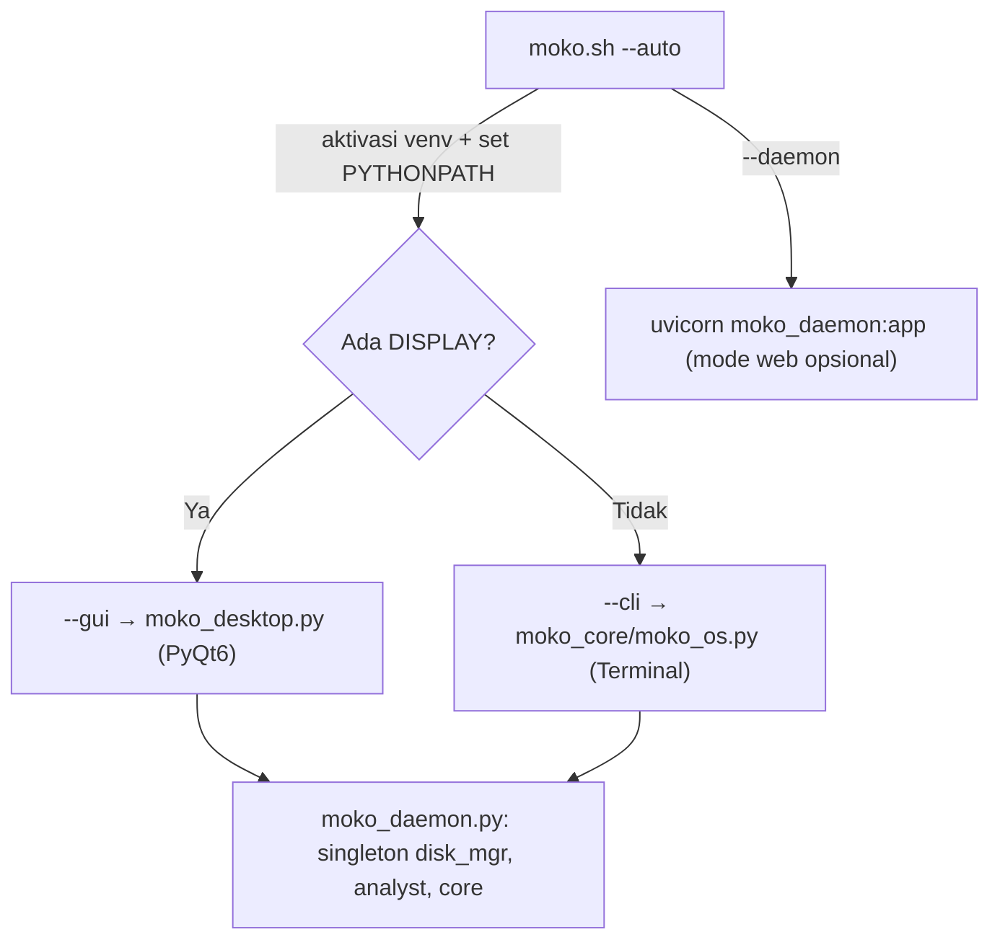
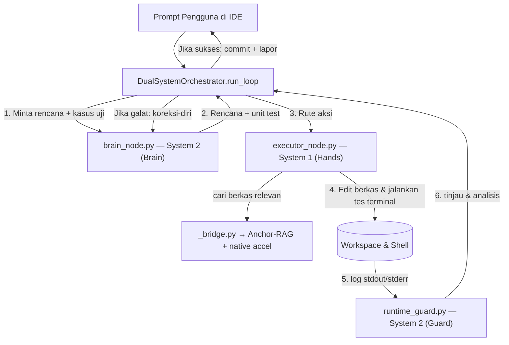
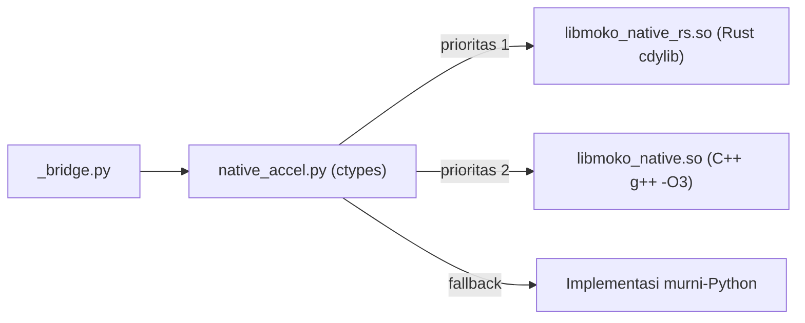
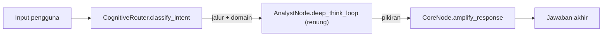
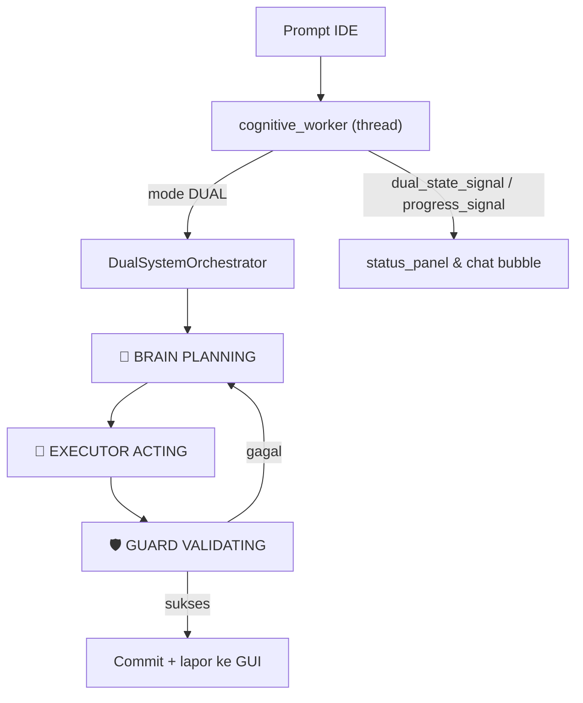
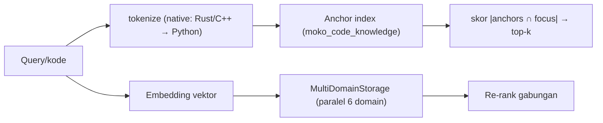

# Struktur Folder & Mekanisme Kerja MOKO OS & IDE v5

> **Dokumen master arsitektur** — bukan sekadar pohon folder. Bagian pertama
> memetakan seluruh struktur direktori (versi terkini setelah pembaruan Dual-System
> & inti akselerasi native), lalu bagian **"Cara Sistem Bekerja"** membedah mekanisme
> setiap subsistem: dari peluncur, mesin inferensi GGUF, otak kognitif multi-agen,
> Sistem Ganda (System 1 + System 2), inti akselerasi C++/Rust, NeuroMath, memori
> omni, Marathon Engine, UI IDE v5, hingga pipeline fine-tuning.
>
> **Perubahan dari versi lama** (yang hanya berisi pohon folder): kini menyertakan
> `moko_agents/dual_system/` dan `moko_core/moko_native/`, penghapusan 8 walkthrough
> usang (folder riset kini berisi 19 berkas), serta walkthrough master baru
> `WALKTHROUGH_MOKO_DUAL_SYSTEM_OVERHAUL.md`.

```
MOKO_OS_Project/
├── bin/                                    # Python virtual environment binaries
│   ├── python -> python3
│   ├── python3 -> /usr/bin/python3
│   ├── pip, pip3, pip3.12
│   ├── accelerate, accelerate-launch, ...
│   ├── gguf-dump, gguf-editor-gui, gguf-set-metadata, ...
│   ├── transformers, trl, torchrun, ...
│   ├── mergekit-*, datasets-cli, huggingface-cli, ...
│   └── z3
│
├── docs/                                   # Dokumentasi & riset
│   ├── __pycache__/
│   ├── .junie/
│   │   └── plans/
│   │       ├── moko-cleanup-and-rag-plan-200mb.md
│   │       └── moko-smart-software-builder.md
│   ├── riset/                              # Dokumentasi riset (19 file .md)
│   │   ├── 01_KONTRIBUSI_ASLI.md
│   │   ├── 02_ANALISIS_KERAS.md
│   │   ├── 03_LANDSKAP_KOMPETITOR.md
│   │   ├── 04_MASALAH_DAN_SOLUSI.md
│   │   ├── 05_RUMUSAN_MATEMATIKA.md
│   │   ├── 06_ARSITEKTUR_INTI.md
│   │   ├── 07_MASA_DEPAN.md
│   │   ├── 08_PETA_EFISIENSI.md
│   │   ├── 09_FORMULASI_EFISIENSI.md
│   │   ├── 10_MULTI_MODEL_DOMAIN_EXPERT.md
│   │   ├── 11_DATA_INVENTORY.md
│   │   ├── 12_INJECT_SCRIPTS.md
│   │   ├── 13_MODEL_FILES.md
│   │   ├── 14_RECONSTRUCTION_ROADMAP.md
│   │   ├── 15_ONION_SEARCH_INTEGRATION.md
│   │   ├── 17_AI_CODING_REVOLUTION.md
│   │   ├── 18_INDUSTRI_CODE_TRAINING_DATA.md
│   │   ├── 20_DEEPSEEK_2026_RESEARCH_MASTER.md
│   │   └── 21_KIMI_AI_RESEARCH_MASTER.md
│   ├── kalkulator_playground.py            # Playground kalkulator (demo eksekusi)
│   ├── moko_code_knowledge.py              # Sistem Anchor-based RAG (indeks kode)
│   ├── moko_llm_runtime_guard.py           # LLMRuntimeGuard (validator runtime)
│   ├── moko_neural_surgery.py              # Editor bobot/laminasi neural
│   ├── moko_template_learning.py           # Pembelajaran berbasis template
│   ├── RINGKASAN_PROGRES.md
│   ├── STRUKTUR_FOLDER_MOKO.md             # (dokumen ini)
│   ├── test_kalkulator_playground.py
│   ├── test_moko_code_knowledge.py
│   ├── test_moko_llm_runtime_guard.py
│   ├── test_moko_template_learning.py
│   ├── test_playground_worker.py
│   └── WALKTHROUGH_MOKO_DUAL_SYSTEM_OVERHAUL.md  # MASTER WALKTHROUGH Sistem Ganda
│
├── finetune/                               # Fine-tuning & training
│   ├── base_model/
│   │   ├── .cache/
│   │   └── Qwen3.5-4B-Uncensored-HauhauCS-Aggressive-BF16.gguf -> symlink
│   ├── base_model_hf/                      # Base model (HuggingFace format)
│   │   ├── .cache/
│   │   ├── config.json
│   │   ├── generation_config.json
│   │   ├── LICENSE
│   │   ├── merges.txt
│   │   ├── model.safetensors
│   │   ├── README.md
│   │   ├── tokenizer_config.json
│   │   ├── tokenizer.json
│   │   └── vocab.json
│   ├── build_moko_coder_dataset.py
│   ├── convert_gguf_to_safetensors.py
│   ├── convert_lora_to_gguf.py
│   ├── dataset_builder.py
│   ├── download_coding_datasets.py
│   ├── logs/                               # (empty)
│   ├── lora_trainer.py
│   ├── merge_datasets.py
│   ├── moko_adapters/
│   │   └── moko_coder/
│   │       ├── checkpoints/
│   │       │   ├── checkpoint-125/
│   │       │   └── README.md
│   │       ├── lora_adapter/
│   │       │   ├── adapter_config.json
│   │       │   ├── adapter_model.safetensors
│   │       │   ├── chat_template.jinja
│   │       │   ├── README.md
│   │       │   ├── tokenizer_config.json
│   │       │   └── tokenizer.json
│   │       ├── status.json
│   │       └── training_config.json
│   ├── moko_coder_quickstart.sh
│   ├── moko_datasets/
│   │   ├── moko_coder_dataset.jsonl
│   │   └── moko_coder_hex.jsonl
│   ├── moko_finetune.py
│   ├── moko_hex_encoder.py
│   ├── __pycache__/
│   ├── train_lora.py
│   └── venv/                               # Python virtual environment
│
├── lib/                                    # Python library
│   └── python3.12/
│       └── site-packages/                  # 187 package directories
│
├── lib64 -> lib                            # Symlink
│
├── moko_core/                              # Core system
│   ├── daemon.log
│   ├── desktop_test.log
│   ├── moko_agents/                        # AI Agents
│   │   ├── __init__.py
│   │   ├── acc_node.py
│   │   ├── adversarial_refiner.py
│   │   ├── amygdala_node.py
│   │   ├── analyst_node.py
│   │   ├── architect_editor_pipeline.py
│   │   ├── auto_continue_engine.py
│   │   ├── autonomous_forager.py
│   │   ├── cerebellum_node.py
│   │   ├── claim_detector.py
│   │   ├── cognitive_executive.py
│   │   ├── cognitive_growth_engine.py
│   │   ├── cognitive_templates.py
│   │   ├── core_node.py
│   │   ├── dispatch_types.py
│   │   ├── dmn_node.py
│   │   ├── domain_models.py
│   │   ├── dual_system/                    # NEW: Sistem Ganda (System 1 + System 2)
│   │   │   ├── __init__.py
│   │   │   ├── brain_node.py               # System 2: penalaran CoT & perencana (gaya DeepSeek)
│   │   │   ├── executor_node.py            # System 1: eksekutor agentik (gaya Kimi)
│   │   │   ├── runtime_guard.py            # System 2 Guard: validator runtime & parser galat
│   │   │   ├── orchestrator.py             # Koordinator loop Plan→Execute→Guard→(re-plan)→Commit
│   │   │   └── _bridge.py                  # Jembatan Anchor-RAG + akselerasi native
│   │   ├── embedding.py
│   │   ├── error_handling_engine.py
│   │   ├── insula_node.py
│   │   ├── intent_router.py
│   │   ├── layers/
│   │   │   ├── knowledge_layer.py
│   │   │   ├── retrieval_layer.py
│   │   │   └── synthesis_layer.py
│   │   ├── learning_manager.py
│   │   ├── live_knowledge_engine.py
│   │   ├── llm_engine.py
│   │   ├── math_query_amplifier.py
│   │   ├── model_dispatcher.py
│   │   ├── moko_ai_rebrander.py
│   │   ├── moko_fisher.py
│   │   ├── moko_identity.py
│   │   ├── moko_multi_agent.py
│   │   ├── neural_layer_mixer.py
│   │   ├── neuro_symbolic_cbc.py
│   │   ├── omni_direct_answer.py
│   │   ├── performance_optimizer.py
│   │   ├── prefrontal_node.py
│   │   ├── rag_agent.py
│   │   ├── repo_mapper.py
│   │   ├── router.py
│   │   ├── software_builder/
│   │   │   ├── __init__.py
│   │   │   ├── interview_manager.py
│   │   │   ├── models.py
│   │   │   ├── plan_generator.py
│   │   │   ├── playground_worker.py
│   │   │   ├── prompt_enrichment.py
│   │   │   ├── step_executor.py
│   │   │   └── token_manager.py
│   │   ├── software_builder_agent.py
│   │   ├── symbol_verifier.py
│   │   ├── test_dispatcher_integration.py
│   │   ├── test_marathon_autocontinue.py
│   │   ├── test_phase35_integration.py
│   │   ├── test_phase36_integration.py
│   │   └── test_rag_integration.py
│   ├── moko_benchmark/
│   │   ├── benchmark_mode.py
│   │   ├── __init__.py
│   │   └── test_vision.py
│   ├── moko_config/
│   │   ├── __init__.py
│   │   └── settings.py
│   ├── moko_cpp_core/
│   │   ├── cpp_loader.py
│   │   ├── libmoko_cpp.so
│   │   └── moko_cpp_core.cpp
│   ├── moko_cpp_kernel/
│   │   ├── libmoko_core.so
│   │   ├── mmap_io.hpp
│   │   ├── moko_kernel.cpp
│   │   ├── simd_math.hpp
│   │   └── thread_pool.hpp
│   ├── moko_cpu/
│   │   ├── cache.py
│   │   ├── governor.py
│   │   ├── __init__.py
│   │   ├── scheduler.py
│   │   └── speculative_loader.py
│   ├── moko_crawler/
│   │   ├── cli.py
│   │   ├── config.py
│   │   ├── __init__.py
│   │   ├── __main__.py
│   │   ├── parser.py
│   │   ├── scheduler.py
│   │   ├── search_providers.py
│   │   ├── search.py
│   │   ├── storage.py
│   │   ├── tor_crawler.py
│   │   └── url_manager.py
│   ├── moko_daemon.py
│   ├── moko_desktop.py
│   ├── moko_inference/
│   │   ├── llama_bin/
│   │   │   ├── cuda_v12/
│   │   │   │   ├── libcublasLt.so.12*
│   │   │   │   ├── libcublas.so.12*
│   │   │   │   ├── libcudart.so.12*
│   │   │   │   └── libggml-cuda.so
│   │   │   ├── cuda_v13/
│   │   │   │   ├── libcublasLt.so.13*
│   │   │   │   ├── libcublas.so.13*
│   │   │   │   ├── libcudart.so.13*
│   │   │   │   └── libggml-cuda.so
│   │   │   ├── libggml-*.so* (CPU optimized libs)
│   │   │   ├── libllama-*.so*
│   │   │   ├── libmtmd.so*
│   │   │   ├── llama-quantize
│   │   │   ├── llama-server
│   │   │   └── vulkan/
│   │   │       └── libggml-vulkan.so
│   │   ├── moko_daemon.py
│   │   ├── moko-embedder.service
│   │   ├── moko_engine.py
│   │   ├── moko-qwen.service
│   │   ├── moko_server.py
│   │   ├── server_manager.py
│   │   └── tor_manager.py
│   ├── moko_marathon/
│   │   ├── code_assembler.py
│   │   ├── code_verifier.py
│   │   ├── context_pager.py
│   │   ├── cross_verifier.py
│   │   ├── git_manager.py
│   │   ├── __init__.py
│   │   ├── marathon_pitstop.py
│   │   ├── marathon_runner.py
│   │   ├── pot_executor.py
│   │   ├── puzzle_assembler.py
│   │   ├── puzzle_planner.py
│   │   ├── security_auditor.py
│   │   ├── semantic_compressor.py
│   │   ├── test_runner.py
│   │   └── token_stream_pager.py
│   ├── moko_memory/
│   │   ├── binary_knowledge_codec.py
│   │   ├── conv_buffer.py
│   │   ├── disk_manager.py
│   │   ├── gc_tuner.py
│   │   ├── hdc_context.py
│   │   ├── math_omni.py
│   │   ├── multi_domain_storage.py
│   │   ├── neural_working_memory.py
│   │   ├── omni_hash_encoder.py
│   │   ├── omni_storage.py
│   │   ├── omni_vector_store.py
│   │   ├── ramdisk.py
│   │   ├── rsa_storage.py
│   │   ├── search_cache.py
│   │   ├── session_store.py
│   │   ├── vector_database.py
│   │   └── wal_manager.py
│   ├── moko_models.py
│   ├── moko_native/                        # NEW: Inti akselerasi native jalur panas Anchor-RAG
│   │   ├── __init__.py
│   │   ├── native_accel.py                 # Loader ctypes: pilih backend Rust → C++ → Python
│   │   ├── build.sh                        # Skrip build C++ (g++ -O3) + Rust (cargo cdylib)
│   │   ├── bench.py                        # Benchmark & uji paritas byte-for-byte
│   │   ├── cpp/
│   │   │   └── moko_native.cpp             # Tier C++ (C ABI: moko_tokenize/index_build/query/free)
│   │   ├── rust/                           # Tier Rust (cdylib, C ABI identik dgn C++)
│   │   │   ├── Cargo.toml
│   │   │   ├── Cargo.lock
│   │   │   └── src/
│   │   │       └── lib.rs
│   │   ├── libmoko_native.so               # Artefak C++ (hasil build, di-.gitignore)
│   │   └── libmoko_native_rs.so            # Artefak Rust (hasil build, di-.gitignore)
│   ├── moko_neuromath/                     # 60+ modules (neural math engine)
│   │   ├── ach_system.py
│   │   ├── active_inference.py
│   │   ├── amygdala.py
│   │   ├── applied_formula_engine.py
│   │   ├── applied_math_dataset.py
│   │   ├── applied_math_trainer.py
│   │   ├── arms_engine.py
│   │   ├── arms_orchestrator.py
│   │   ├── basal_ganglia.py
│   │   ├── bcm_synapse.py
│   │   ├── cls_consolidator.py
│   │   ├── cognitive_map.py
│   │   ├── computer_math_engine.py
│   │   ├── cs_math_engine.py
│   │   ├── dimensional_analysis_engine.py
│   │   ├── dimensional_synthesis.py
│   │   ├── dof_resolver.py
│   │   ├── domain_scope_guard.py
│   │   ├── dopamine_scheduler.py
│   │   ├── electronics_deep_engine.py
│   │   ├── engine_advanced_math.py
│   │   ├── episodic_buffer.py
│   │   ├── epistemic_forager.py
│   │   ├── exact_math_engine.py
│   │   ├── fep_engine.py
│   │   ├── formal_reasoning_engine.py
│   │   ├── formula_critic.py
│   │   ├── formula_genesis_engine.py
│   │   ├── formula_validator.py
│   │   ├── hebb_linker.py
│   │   ├── hpa_axis.py
│   │   ├── locus_coeruleus.py
│   │   ├── math_cas_engine.py
│   │   ├── math_normalizer.py
│   │   ├── math_synergy_monitor.py
│   │   ├── mcts_reasoner.py
│   │   ├── mutation_queue.py
│   │   ├── oscillation_context.py
│   │   ├── pattern_conjecturer.py
│   │   ├── program_verification_engine.py
│   │   ├── pure_math_engine.py
│   │   ├── quantum_simulator.py
│   │   ├── run_applied_training.py
│   │   ├── self_optimization_math.py
│   │   ├── serotonin_system.py
│   │   ├── signal_frequency_engine.py
│   │   ├── sleep_consolidation.py
│   │   ├── sleep_finetuner.py
│   │   ├── sleep_scheduler.py
│   │   ├── spatial_math_engine.py
│   │   ├── step_logic_prover.py
│   │   ├── story_math_parser.py
│   │   ├── symbolic_regression.py
│   │   ├── symbolic_synthesizer.py
│   │   ├── synergy_router.py
│   │   ├── tensor_manifold_engine.py
│   │   ├── thalamus_gate.py
│   │   ├── training_state.py
│   │   ├── turing_consciousness_engine.py
│   │   ├── uncertainty_engine.py
│   │   └── web_crawler.py
│   ├── moko_ollama.log
│   ├── moko_os.py
│   ├── moko_puzzles/
│   │   ├── base_puzzle.py
│   │   ├── __init__.py
│   │   ├── puzzle_code.py
│   │   ├── puzzle_general.py
│   │   ├── puzzle_hardware.py
│   │   ├── puzzle_kbbi.py
│   │   ├── puzzle_math.py
│   │   ├── puzzle_os_control.py
│   │   ├── puzzle_physics.py
│   │   ├── puzzle_reasoning.py
│   │   └── puzzle_registry.py
│   ├── moko_rust_core/
│   │   ├── Cargo.lock
│   │   ├── Cargo.toml
│   │   └── src/
│   │       └── lib.rs
│   ├── moko_security/
│   │   ├── blue_team_defender.py
│   │   ├── gaussian_noise_engine.py
│   │   ├── __init__.py
│   │   └── red_team_fuzzer.py
│   ├── moko_super_learning/
│   │   ├── curriculum.py
│   │   ├── __init__.py
│   │   ├── satisfaction_engine.py
│   │   └── super_learning_worker.py
│   ├── moko_tools/
│   │   ├── byteq_loader.py
│   │   ├── byteq_quantizer.py
│   │   ├── dataset_collector.py
│   │   ├── gguf_editor.py
│   │   ├── gguf_quantizer.py
│   │   ├── moko_ide.py
│   │   ├── onion_search.py
│   │   ├── project_indexer.py
│   │   ├── quantize_domain_models.py
│   │   ├── test_byteq_roundtrip.py
│   │   ├── torbot_integrator.py
│   │   └── vision_helper.py
│   ├── moko_ui/
│   │   ├── code_structure.py
│   │   ├── editor_ai_bridge.py
│   │   ├── __init__.py
│   │   ├── lsp_client.py
│   │   ├── main_window.py
│   │   ├── main_window_v5.py
│   │   ├── panels/
│   │   │   ├── activity_bar.py
│   │   │   ├── chat_panel.py
│   │   │   ├── curriculum_tab.py
│   │   │   ├── editor_panel.py
│   │   │   ├── logic_synthesis_panel.py
│   │   │   ├── math_trainer_panel.py
│   │   │   ├── omni_trainer_panel.py
│   │   │   ├── plan_widgets.py
│   │   │   ├── search_panel.py
│   │   │   ├── settings_panel.py
│   │   │   ├── sidebar_panel.py
│   │   │   ├── status_panel.py
│   │   │   ├── terminal_panel.py
│   │   │   └── xray_panel.py
│   │   ├── session_store.py
│   │   ├── styles/
│   │   │   └── cyberpunk_qss.py
│   │   ├── subverbal_engine.py
│   │   ├── terminal_ui.py
│   │   └── workers/
│   │       ├── code_utils.py
│   │       ├── cognitive_worker.py
│   │       ├── deep_synthesis_worker.py
│   │       ├── hw_worker.py
│   │       ├── logic_synthesis_worker.py
│   │       ├── omni_worker.py
│   │       ├── self_repair_worker.py
│   │       ├── sleep_worker.py
│   │       └── topic_learning_worker.py
│   ├── test_code_structure.py
│   ├── test_dual_direct.py
│   ├── test_dual.py
│   ├── test_dual_system.py                 # NEW: integrasi end-to-end Sistem Ganda
│   ├── test_engine.py
│   ├── test_full_flow.py
│   ├── test_lsp_integration.py
│   ├── test_memory.py
│   ├── test_native_accel.py                # NEW: paritas & benchmark inti native
│   ├── test_neural_fusion.py
│   ├── test_omni.py
│   ├── test_turing_bombe.py
│   └── venv/                               # Python virtual environment
│
├── share/
│   └── man/
│       └── man1/
│
├── .git/                                   # Git repository
├── .junie/                                 # Junie AI config & rencana kerja
│   └── plans/
│       └── moko-dual-system-overhaul.md    # Plan perombakan Sistem Ganda
├── .math_omni/
│   ├── E2-D9-LOG1.bin
│   ├── E2-D9-LOG2.bin
│   ├── E2-D9-LOG3.bin
│   ├── E2-D9-LOG4.bin
│   ├── formula_sidecar.jsonl
│   └── hebb_assemblies.jsonl
├── .moko_cache/
│   └── token_stream_chat_moko_chat.jsonl
├── .moko_omni/                             # Knowledge domain storage
│   ├── code/                               # 586 entries
│   ├── finance/                            # 36 entries
│   ├── general/                            # 219 entries
│   ├── math/                               # 564 entries
│   ├── personal/                           # 36 entries
│   └── security/
├── .vscode/
│   └── settings.json
│
├── build_kernel.sh
├── hs_err_pid38450.log
├── MOKO-AI-4B-CryptoCore-Q3_K_M_moko_meta.json
├── MOKO-AI-4B-Q3_K_M.gguf                 # Model GGUF (~2.26GB)
├── MOKO-Coder-1.5B-Uncensored-F16.gguf    # Model GGUF (~3.56GB)
├── moko_cli.sh
├── moko-fix-limits.sh
├── .moko_claim_centroids.json
├── .moko_domain_centroids.json
├── .moko_forager_state.json
├── .moko_session.jsonl
├── .moko_super_learning_state.json
├── moko_header_MOKO-AI-4B-CryptoCore-BF16.json
├── moko_header_MOKO-AI-4B-CryptoCore-Q3_K_M.json
├── moko_launcher.sh
├── moko-models.sh
├── MOKO-RAG-1.5B-ByteQ_moko_meta.json
├── moko-rag.gguf                          # Model GGUF (~1GB)
├── moko.sh
├── moko-warmup.sh
├── pyvenv.cfg
├── quantization_rag.log
└── quantize_rag.log
```

---

## Ringkasan Komponen Utama

| Komponen | Peran | Mekanisme Inti |
|----------|-------|----------------|
| `moko_core/moko_agents` | 45+ modul agen AI (kognitif, routing, learning) | Otak kognitif; router semantik + node terinspirasi neurosains + Sistem Ganda |
| `moko_core/moko_agents/dual_system` | **NEW** — Sistem Ganda (System 1 + System 2) | Loop agentik Plan→Execute→Guard→(re-plan)→Commit |
| `moko_core/moko_native` | **NEW** — Inti akselerasi native (C++/Rust) | Jalur panas Anchor-RAG (tokenisasi + skoring + top-k) via ctypes |
| `moko_core/moko_neuromath` | 60+ modul mesin matematika neuro-simbolik | Pipeline ARMS + CAS + node neurotransmiter + konsolidasi tidur |
| `moko_core/moko_memory` | 18+ modul memori/penyimpanan | RSAStorage + pencarian multi-domain paralel + WAL |
| `moko_core/moko_inference` | Mesin inferensi LLM (llama.cpp + CUDA/Vulkan) | GGUF in-process via llama-cpp-python (0ms HTTP) |
| `moko_core/moko_ui` | Panel GUI IDE v5, style, worker thread | PyQt6; worker latar belakang mengalirkan token & status ke main thread |
| `moko_core/moko_marathon` | Eksekusi maraton & verifikasi kode | Penalaran berantai + context pager + kompresi semantik |
| `moko_core/moko_tools` | Editor/quantizer GGUF, alat IDE | ByteQ, gguf_editor, project_indexer, onion_search |
| `moko_core/moko_security` | Blue team defender, red team fuzzer | Pertahanan & fuzzing adversarial |
| `moko_core/moko_cpp_core` | Inti native C++ (libmoko_cpp.so) | Operasi vektor/kompute panas |
| `moko_core/moko_cpp_kernel` | Kernel C++ (libmoko_core.so) | SIMD math + thread pool + mmap I/O |
| `moko_core/moko_rust_core` | Pustaka inti Rust | Rutin native memory-safe |
| `moko_core/moko_crawler` | Crawler Web/Tor | Foraging pengetahuan darkweb/clearnet |
| `moko_core/moko_config` | Setting & konfigurasi | Sumber tunggal path & parameter |
| `moko_core/moko_cpu` | Governor & scheduler CPU | Speculative loader, cache, tuning frekuensi |
| `moko_core/moko_puzzles` | Sistem tantangan puzzle | Registry puzzle per-domain |
| `moko_core/moko_super_learning` | Kurikulum belajar mandiri | Satisfaction engine + worker belajar |
| `moko_core/moko_benchmark` | Benchmark & uji vision | Mode benchmark + vision test |
| `finetune/` | Pipeline fine-tuning LoRA | MuonClip + SFT agentic `<thought>/<action>` |
| `docs/riset/` | 19 dokumen riset ilmiah | Termasuk riset 20 (DeepSeek) & 21 (Kimi AI) |
| `docs/moko_code_knowledge.py` | Sistem Anchor-based RAG | Indeks anchor + retrieval top-k jalur panas |
| `docs/moko_llm_runtime_guard.py` | LLMRuntimeGuard | Validasi runtime + parsing traceback |
| `bin/` | Binari venv Python | transformers, TRL, alat GGUF, z3 |

---

# Cara Sistem Bekerja — Anatomi Mekanisme

Bagian ini menjelaskan **bagaimana** setiap subsistem bekerja dan **bagaimana** mereka
saling berbicara, bukan hanya di mana letaknya. Susunannya mengikuti arus data: dari
peluncur → mesin inferensi → otak kognitif → Sistem Ganda → akselerasi native →
subsistem pendukung → pelatihan.

## 1. Lapisan Peluncur & Titik Masuk

MOKO tidak dijalankan sebagai layanan web; ia adalah OS AI berdaulat (*sovereign*) yang
berjalan penuh di dalam satu proses Python. Peluncur `moko.sh` adalah gerbangnya:



- **`moko.sh`** — *smart launcher*. Memvalidasi/membuat virtualenv di `moko_core/venv`,
  mengaktifkannya, menyetel `PYTHONPATH`, lalu memilih mode: `--auto` (deteksi X11/Wayland),
  `--cli`, `--gui`, atau `--daemon`. Skrip pendamping: `moko_launcher.sh`, `moko_cli.sh`,
  `moko-models.sh` (kelola berkas model), `moko-warmup.sh` (pemanasan model),
  `moko-fix-limits.sh` (batas ulimit), `build_kernel.sh` (kompilasi kernel C++).
- **`moko_core/moko_os.py`** — titik masuk **CLI**. Loop REPL: baca input → `CognitiveRouter.classify_intent()`
  → `AnalystNode.deep_think_loop()` (merenung) → `CoreNode.amplify_response()` (jawaban akhir).
- **`moko_core/moko_desktop.py`** — titik masuk **GUI** (memuat `moko_ui/main_window_v5.py`).
- **`moko_core/moko_daemon.py`** — backend murni Python (tanpa FastAPI wajib) yang membuat
  **singleton** `disk_mgr`, `analyst`, `core` untuk dipakai bersama oleh seluruh worker thread GUI.

## 2. Mesin Inferensi GGUF In-Process (`moko_inference/`)

Inti eksekusi model. **`moko_engine.py`** memuat berkas GGUF langsung via
`llama-cpp-python` di dalam proses yang sama — **tidak ada HTTP, tidak ada Ollama,
tidak ada biner pihak ketiga** yang mengontrol keluaran. Keuntungan: 0ms overhead soket
& serialisasi JSON, kontrol penuh atas *chat template*.

- **`ThinkFilter`** — mesin state streaming yang menyaring blok `<think>...</think>`
  secara token-demi-token (menangani tag terpotong di batas buffer), sehingga penalaran
  internal tidak bocor ke pengguna, namun tetap bisa ditangkap untuk panel X-Ray.
- **VRAM crypto-optimized** (Phase 18): kompresi memori kriptografis + PQC signing opsional
  untuk setiap inferensi.
- **`llama_bin/`** — biner llama.cpp beserta pustaka akselerasi: `cuda_v12/`, `cuda_v13/`
  (cuBLAS/cudart/ggml-cuda), varian CPU teroptimasi, dan `vulkan/libggml-vulkan.so`.
- **`server_manager.py` / `moko_server.py`** — pengelolaan mode server jika diperlukan;
  `tor_manager.py` untuk rute anonim.

## 3. Otak Kognitif Multi-Agen (`moko_agents/`)

Lebih dari 45 modul yang membentuk "sistem saraf" MOKO. Alur klasik: **Router → Analyst → Core**,
diperkaya node terinspirasi neurosains dan dispatcher model.

- **`router.py` (`CognitiveRouter`)** — *The Pathfinder* berbasis **ruang vektor semantik**.
  Tiga tingkat: (0-A) *slash command* & *fast-match* eksak (<1ms bypass); (0-B) **Semantic Vector
  Router** menghitung *cosine similarity* query terhadap **centroid domain** (embedding rata-rata,
  di-cache di `.moko_domain_centroids.json`, ~15ms); (0-C) fallback keyword rule-based. Keluaran:
  jalur `FAST_PATH` / `DEEP_PATH` / `BROWSING_PATH` + domain (code/math/security/general/…).
- **`intent_router.py`** — klasifikasi *intent-first* sebagai lapisan tambahan router.
- **`analyst_node.py` (System-2 klasik) & `core_node.py` (System-1 klasik)** — Analyst merenung
  iteratif (`deep_think_loop`), Core memperkuat menjadi jawaban akhir tak-tersensor.
- **`model_dispatcher.py`** — **manajer VRAM & pengalih model domain** dengan filosofi
  *"satu ahli pada satu waktu"*. Menyimpan 4 model domain (coding 1.5B, math 1.0B, security 1.0B,
  general 2.0B) dengan status `UNLOADED/LOADING/STANDBY/ACTIVE/UNLOADING`; menjaga 1 aktif + 1 standby
  agar peralihan mulus di GPU 4GB.
- **Node terinspirasi neurosains** — `amygdala_node`, `prefrontal_node`, `cerebellum_node`,
  `insula_node`, `dmn_node` (*default mode network*), `acc_node`: memberi regulasi
  emosi/atensi/koordinasi pada pipeline penalaran.
- **`cognitive_executive.py`, `cognitive_growth_engine.py`, `learning_manager.py`,
  `live_knowledge_engine.py`** — eksekutif kognitif, pertumbuhan, dan pembelajaran daring.
- **`rag_agent.py`, `repo_mapper.py`, `embedding.py`, `layers/`** — retrieval + pemetaan repo;
  `layers/` memisahkan *knowledge → retrieval → synthesis*.
- **`software_builder/`** — agen pembangun perangkat lunak: `interview_manager` (wawancara
  kebutuhan) → `plan_generator` (rencana) → `step_executor` (eksekusi langkah) → `playground_worker`
  (uji coba) + `token_manager`/`prompt_enrichment`.
- **`moko_identity.py`, `moko_ai_rebrander.py`** — menjaga identitas & rebranding MOKO agar tidak
  mengaku sebagai model lain.

## 4. Sistem Ganda / Dual-System (`moko_agents/dual_system/`) — *Flagship*

Inti perombakan terbaru: mengubah mode `DUAL` dari sekadar "berpikir lalu menjawab" menjadi
**loop pengembangan perangkat lunak yang agentik, kolaboratif, dan mengoreksi-diri**, memadukan
penalaran gaya **DeepSeek (System 2)** dengan eksekusi agentik gaya **Kimi (System 1)**. Rincian
lengkap ada di `WALKTHROUGH_MOKO_DUAL_SYSTEM_OVERHAUL.md`.



- **`brain_node.py` (System 2 — Otak)** — penalaran *Chain-of-Thought*, menyusun rencana taktis
  langkah-demi-langkah, dan **membuat berkas unit test** sebelum kode ditulis.
- **`executor_node.py` (System 1 — Tangan)** — operasi berkas presisi (baca/tulis/edit),
  eksekusi perintah terminal, dan pencarian berkas target lewat Anchor-RAG.
- **`runtime_guard.py` (System 2 — Penjaga)** — mengintegrasikan `LLMRuntimeGuard`
  (`docs/moko_llm_runtime_guard.py`), mem-parsing *traceback*/galat, memutuskan **lolos**
  (→ commit) atau **gagal** (→ memicu koreksi-diri ke Brain).
- **`orchestrator.py`** — koordinator pusat kalang **Plan → Execute → Guard → (jika gagal) Re-plan → Commit**.
- **`_bridge.py`** — jembatan transparan ke **Anchor-RAG** (`docs/moko_code_knowledge.py`) dan
  **inti native** (`moko_native`), dengan *fallback* murni-Python bila modul asli/toolchain tidak ada.

## 5. Inti Akselerasi Native C++/Rust (`moko_native/`)

Ketika Python menjadi *bottleneck*, jalur panas Anchor-RAG (tokenisasi + skoring anchor +
peringkat top-k) dipindah ke inti native, dengan *fallback* murni-Python yang **identik
byte-for-byte**.



- **C ABI stabil & identik antar-tier**: `moko_tokenize`, `moko_index_build`, `moko_index_query`,
  `moko_index_query_text`, `moko_index_free`. Baik tier C++ (`cpp/moko_native.cpp`) maupun tier
  Rust (`rust/` → `cdylib`) mengekspor tanda tangan yang sama, sehingga satu loader ctypes memuat
  keduanya tanpa perubahan.
- **Pemilihan backend otomatis** oleh `native_accel.py`: Rust → C++ → Python (dapat dipaksa lewat
  `MOKO_NATIVE_LIB`).
- **Paritas kontrak dengan Python**: tokenisasi = `[a-zA-Z_]{2,}` (lowercase); retrieval
  `score = |anchors ∩ focus|`, disimpan bila ≥1, diurut `(score desc, index asc)`, ambil top-k.
- **Build & uji**: `build.sh` mengompilasi kedua tier; `bench.py` mengukur kecepatan; artefak
  `.so` diabaikan git. Benchmark menunjukkan jalur gabungan `query_text` ~1.6–1.75× lebih cepat
  dengan hasil identik.

## 6. NeuroMath — Mesin Matematika Neuro-Simbolik (`moko_neuromath/`)

60+ modul yang menjadikan MOKO kuat di matematika/fisika/teknik nyata, memadukan simbolik-eksak
dengan mekanisme terinspirasi otak.

- **Pipeline ARMS** (*Applied Real-world Math Solver*): `story_math_parser` (L0: ekstraksi problem
  dari narasi) → `applied_formula_engine` (L2: LOOKUP → DERIVE → SYNTHESIZE rumus) →
  `arms_orchestrator` (L3: menghasilkan `ARMSSolution` berisi nilai, satuan SI, langkah kerja,
  dan status `SUCCESS/PARTIAL/PARSE_FAIL/NO_FORMULA/COMPUTE_ERR`).
- **Mesin komputasi**: `math_cas_engine`, `exact_math_engine`, `pure_math_engine`,
  `computer_math_engine`, `cs_math_engine`, `dimensional_analysis_engine`, `spatial_math_engine`,
  `signal_frequency_engine`, `electronics_deep_engine`, `quantum_simulator`.
- **Penalaran & pembuktian**: `mcts_reasoner` (MCTS), `formal_reasoning_engine`,
  `step_logic_prover`, `program_verification_engine`, `symbolic_regression`, `formula_genesis_engine`
  + `formula_critic`/`formula_validator`.
- **Neurotransmiter & regulasi** (metafora belajar/atensi): `dopamine_scheduler`, `serotonin_system`,
  `ach_system`, `locus_coeruleus`, `hpa_axis`, `basal_ganglia`, `amygdala`, `thalamus_gate`,
  `bcm_synapse`, `hebb_linker`.
- **Konsolidasi tidur**: `sleep_consolidation`, `sleep_finetuner`, `sleep_scheduler`,
  `cls_consolidator` — memindahkan memori kerja ke penyimpanan jangka panjang saat idle.
- **Router internal**: `synergy_router`, `math_synergy_monitor`, `domain_scope_guard` menjaga agar
  jawaban tetap dalam ruang lingkup matematis yang valid.

## 7. Memori Omni & Penyimpanan (`moko_memory/` + `.moko_omni/`)

Sistem memori berlapis yang menyimpan pengetahuan sebagai vektor terenkripsi per-domain.

- **`rsa_storage.py` (`RSAStorage`)** — penyimpanan vektor per-domain (pure-Python, aman untuk thread).
- **`multi_domain_storage.py` (`MultiDomainStorage`)** — mencari beberapa domain **secara paralel**
  (`ThreadPoolExecutor`, maks 6 worker), dengan *early-exit* saat menemukan hasil sangat relevan
  (skor ≥0.92) dan *re-ranking* terpusat. Domain fisik ada di `.moko_omni/`:
  `code/` (586), `math/` (564), `general/` (219), `finance/` (36), `personal/` (36), `security/`.
- **`omni_vector_store.py`, `vector_database.py`, `omni_hash_encoder.py`,
  `binary_knowledge_codec.py`** — indeks & codec vektor/biner.
- **`hdc_context.py`** — konteks hyperdimensional; **`neural_working_memory.py`** — memori kerja;
  **`conv_buffer.py`** — buffer percakapan; **`session_store.py`** — sesi.
- **`wal_manager.py`** — *write-ahead log* untuk durabilitas; **`ramdisk.py`**, **`disk_manager.py`**,
  **`gc_tuner.py`**, **`search_cache.py`** — manajemen disk/RAM, tuning GC, dan cache pencarian.
- **`.math_omni/`** menyimpan sidecar formula & *hebbian assemblies*; berkas status root
  (`.moko_domain_centroids.json`, `.moko_claim_centroids.json`, `.moko_forager_state.json`,
  `.moko_session.jsonl`, `.moko_super_learning_state.json`) menjaga state antar-sesi.

## 8. Marathon Engine — Penalaran Berantai Panjang (`moko_marathon/`)

Untuk soal berat yang butuh banyak langkah, `marathon_runner.py` menjalankan **loop penalaran maraton**:

1. `context_pager.py` membangun *active context* dari langkah-langkah sebelumnya.
2. Setiap langkah memanggil LLM dengan aturan tag `[CONTINUE]` / `[FINAL ANSWER]`; *thinking* dimatikan
   di langkah antara demi hemat token, diaktifkan di langkah sintesis akhir.
3. `semantic_compressor.py` mengompresi CoT tiap langkah agar konteks tetap padat.
4. `code_assembler`/`code_verifier`/`cross_verifier`/`test_runner`/`security_auditor` merakit &
   memverifikasi kode; `git_manager` menangani commit; `puzzle_planner`/`puzzle_assembler`/`pot_executor`
   untuk penyelesaian berbasis puzzle.

## 9. UI / Moko IDE v5 (`moko_ui/`)

GUI PyQt6 dengan pola **worker thread + sinyal** agar UI tetap responsif.

- **`main_window_v5.py`** — jendela utama IDE v5, mengendalikan sinyal GUI ke pipeline agen.
- **`panels/`** — `chat_panel`, `editor_panel`, `terminal_panel`, `search_panel`, `settings_panel`,
  `sidebar_panel`, `activity_bar`, `status_panel`, `xray_panel` (intip penalaran), `math_trainer_panel`,
  `omni_trainer_panel`, `logic_synthesis_panel`, `curriculum_tab`, `plan_widgets`.
- **`workers/`** — thread latar belakang: **`cognitive_worker.py`** (saat mode `DUAL`, mengimpor &
  menjalankan `DualSystemOrchestrator.run_loop()`, memancarkan `dual_state_signal`/`progress_signal`
  ke main thread), `deep_synthesis_worker`, `omni_worker`, `sleep_worker`, `self_repair_worker`,
  `hw_worker`, `logic_synthesis_worker`, `topic_learning_worker`.
- **Indikator status ganda** di `status_panel.py` & `main_window_v5.py` menampilkan state aktif:
  **`🧠 BRAIN PLANNING`** (System 2 menyusun rencana/unit test), **`🔧 EXECUTOR ACTING`**
  (System 1 menelusuri repo/mengedit/menjalankan terminal), **`🛡️ GUARD VALIDATING`**
  (System 2 Guard mengevaluasi log & integritas runtime).
- **Pendukung editor**: `lsp_client.py` (LSP), `editor_ai_bridge.py`, `code_structure.py`,
  `subverbal_engine.py`, `terminal_ui.py`, dan tema `styles/cyberpunk_qss.py`.

## 10. Inti Native Lain & Akselerasi CPU

- **`moko_cpp_core/`** (`libmoko_cpp.so` via `cpp_loader.py`) & **`moko_cpp_kernel/`**
  (`libmoko_core.so` dengan `simd_math.hpp`, `thread_pool.hpp`, `mmap_io.hpp`) — kompute panas C++.
- **`moko_rust_core/`** — crate Rust (`Cargo.toml` + `src/lib.rs`) untuk rutin memory-safe.
- **`moko_cpu/`** — `governor.py` (frekuensi CPU), `scheduler.py`, `speculative_loader.py`
  (pramuat spekulatif), `cache.py`.

## 11. Utilitas Pendukung

- **`moko_crawler/`** — crawler clearnet & Tor (`tor_crawler`, `search_providers`, `url_manager`,
  `scheduler`, `storage`) untuk *knowledge foraging*.
- **`moko_security/`** — `blue_team_defender`, `red_team_fuzzer`, `gaussian_noise_engine`
  (pertahanan & fuzzing adversarial).
- **`moko_super_learning/`** — `curriculum`, `satisfaction_engine`, `super_learning_worker`
  (belajar mandiri berkelanjutan).
- **`moko_tools/`** — `gguf_editor`, `gguf_quantizer`, `byteq_quantizer`/`byteq_loader` (kuantisasi
  ByteQ), `onion_search`, `torbot_integrator`, `project_indexer`, `moko_ide`, `vision_helper`.
- **`moko_puzzles/`** — registry puzzle per-domain (code/math/physics/hardware/kbbi/reasoning/os_control).
- **`moko_benchmark/`** — `benchmark_mode`, `test_vision`.
- **`moko_config/settings.py`** — sumber tunggal path (`WORKSPACE_DIR`) & parameter global.

## 12. Pipeline Fine-Tuning (`finetune/`)

Menyiapkan pelatihan lokal MOKO-Coder dengan stabilitas & format ala DeepSeek-R1 / Kimi K2.

- **`lora_trainer.py` & `train_lora.py`** — pelatihan LoRA memakai optimizer **MuonClip**
  (Newton-Schulz orthonormalize + RMS matching + **QK-Clip**) untuk mencegah *logit/gradient explosion*
  pada model besar.
- **`build_moko_coder_dataset.py`** — sintesis dataset SFT agentic dengan tag berpasangan
  `<thought>…</thought>` / `<action>…</action>` + *Verifiable Rewards* (imbalan dari keberhasilan
  kompilasi & unit-test).
- **`convert_gguf_to_safetensors.py` / `convert_lora_to_gguf.py`**, `dataset_builder.py`,
  `merge_datasets.py`, `download_coding_datasets.py`, `moko_hex_encoder.py`, `moko_finetune.py`.
- **`base_model_hf/`** (bobot HF), **`moko_adapters/moko_coder/`** (adapter LoRA + checkpoint + status),
  **`moko_datasets/`** (`moko_coder_dataset.jsonl`, `moko_coder_hex.jsonl`).

## 13. Dokumentasi & Riset (`docs/`)

- **`riset/`** — 19 dokumen riset ilmiah (01–15, 17–18, 20–21). Sorotan: **`20_DEEPSEEK_2026_RESEARCH_MASTER.md`**
  (fondasi System 2) & **`21_KIMI_AI_RESEARCH_MASTER.md`** (fondasi System 1 + MuonClip).
- **`WALKTHROUGH_MOKO_DUAL_SYSTEM_OVERHAUL.md`** — walkthrough master arsitektur Sistem Ganda.
- **`moko_code_knowledge.py`** (Anchor-RAG) & **`moko_llm_runtime_guard.py`** (LLMRuntimeGuard) —
  dua modul riset yang **dipakai langsung** oleh `dual_system` di runtime.
- **`moko_neural_surgery.py`**, **`moko_template_learning.py`**, **`kalkulator_playground.py`** +
  berkas tes terkait.

---

# Alur Kerja End-to-End

### A. Siklus Query CLI (`moko_os.py`)



### B. Loop Agentik DUAL di IDE (mode DUAL)



### C. Retrieval Pengetahuan (Anchor-RAG + Memori Omni)



---

# Model GGUF & Berkas Status di Root

| Berkas | Keterangan |
|--------|-----------|
| `MOKO-AI-4B-Q3_K_M.gguf` | Model utama ~2.26 GB (kuantisasi Q3_K_M) |
| `MOKO-Coder-1.5B-Uncensored-F16.gguf` | Model coder ~3.56 GB (F16) — fondasi System 1 |
| `moko-rag.gguf` | Model RAG ~1 GB (ByteQ) untuk retrieval/embedding |
| `MOKO-AI-4B-CryptoCore-*_moko_meta.json` / `moko_header_*.json` | Metadata & header model |
| `.moko_domain_centroids.json` | Cache centroid domain untuk router semantik |
| `.moko_claim_centroids.json` | Centroid deteksi klaim |
| `.moko_forager_state.json` | State autonomous forager |
| `.moko_session.jsonl` / `.moko_cache/` | Riwayat sesi & token-stream cache |
| `.moko_super_learning_state.json` | State kurikulum belajar mandiri |

---

# Catatan Versi — Perubahan dari Struktur Sebelumnya

Dibanding versi lama dokumen ini (yang hanya berupa pohon folder), berikut yang **baru/berubah**:

- **+ `moko_core/moko_agents/dual_system/`** — paket Sistem Ganda (brain/executor/runtime_guard/orchestrator/_bridge).
- **+ `moko_core/moko_native/`** — inti akselerasi C++/Rust untuk jalur panas Anchor-RAG.
- **+ `moko_core/test_dual_system.py`** dan **`moko_core/test_native_accel.py`** — tes integrasi & paritas.
- **+ `docs/WALKTHROUGH_MOKO_DUAL_SYSTEM_OVERHAUL.md`** — walkthrough master baru.
- **− 8 walkthrough usang dihapus**: `WALKTHROUGH_KALKULATOR_PLAYGROUND.md`, `WALKTHROUGH_LLM_PLAY_RESPONSE_FIX.md`,
  `WALKTHROUGH_MOKO_CODER.md`, `WALKTHROUGH_MOKO_IDE_v5.md`, `WALKTHROUGH_MOKO_TEMPLATE_LEARNING.md`,
  `riset/16_SYSTEM_WALKTHROUGH.md`, `riset/19_MASTER_WALKTHROUGH.md`, dan
  plan `moko-system-walkthrough-and-integration.md` → **folder `riset/` kini 19 berkas**.
- **± Dokumen ini diperluas** dari sekadar pohon folder menjadi **panduan mekanisme kerja** lengkap
  per subsistem beserta diagram alur.
