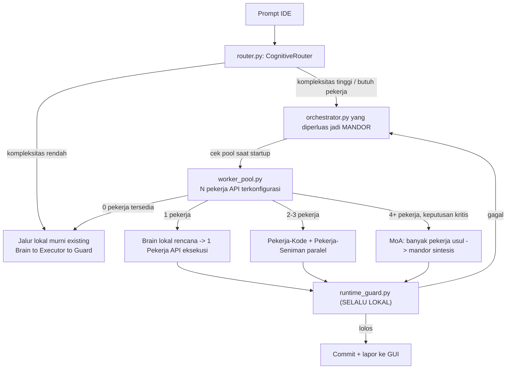

# Arsitektur Hybrid Mandor–Pekerja untuk MOKO OS
## Menembus Batas VRAM 4GB Lewat Orkestrasi Multi-Agent, Bukan Skala Hardware

> **Dokumen riset arsitektur** — companion untuk `STRUKTUR_FOLDER_MOKO.md`, melanjutkan
> `docs/riset/20_DEEPSEEK_2026_RESEARCH_MASTER.md` & `21_KIMI_AI_RESEARCH_MASTER.md`.
> Disarankan disimpan sebagai **`docs/riset/22_HYBRID_MANDOR_PEKERJA_ORCHESTRATION.md`**
> agar penomoran riset tetap berurutan.
>
> **Pertanyaan inti yang dijawab dokumen ini:** apakah realistis membangun AI *coding
> assistant* kelas IDE profesional yang berjalan penuh di VRAM 4GB, dan apakah desain
> hybrid "1 AI mandor lokal + N AI pekerja API" adalah jalan keluar yang sehat secara
> teknis — bukan sekadar kompromi darurat.

---

## Ringkasan Eksekutif

Tiga kesimpulan utama dari riset ini:

1. **Diagnosis Anda benar, dan ini bukan kegagalan rekayasa.** VRAM 4GB adalah **batas
   fisik**, bukan batas strategi. `model_dispatcher.py` yang sudah ada di MOKO (memuat
   1 model aktif + 1 standby, filosofi *"satu ahli pada satu waktu"*) adalah mitigasi
   paling cerdas yang mungkin dilakukan **di dalam** batas itu — tapi tetap tidak bisa
   membuat model 1.5B bernalar setara model dengan puluhan miliar parameter aktif.
2. **Ide hybrid mandor–pekerja Anda bukan kompromi — itu arsitektur yang sama persis
   dengan produk komersial unggulan Sakana AI (Jepang) bernama Fugu**, yang diluncurkan
   pertengahan 2026 dan secara eksplisit dirancang untuk mengatasi masalah yang identik:
   satu model kecil yang belajar mengorkestrasi kumpulan model besar, alih-alih melatih
   satu model raksasa. Ini didukung dua makalah ICLR 2026 (**TRINITY** dan **Conductor**).
3. **`moko_agents/dual_system/` yang sudah Anda bangun (Brain–Executor–Guard) secara
   struktural sudah ~80% menuju arsitektur ini.** Yang dibutuhkan bukan membangun ulang,
   melainkan membuka slot "Executor" agar bisa diisi oleh pekerja API eksternal, dan
   menambahkan lapisan manajemen pool pekerja yang dikonfigurasi secara dinamis.

Sisa dokumen ini membedah kenapa (Bagian 1–3), lalu bagaimana (Bagian 4–6).

> **Catatan penting soal istilah "Fugu" dan "RSI":** keduanya berasal dari perusahaan
> yang sama (Sakana AI) tapi merujuk ke **dua inisiatif berbeda**. **Fugu** adalah produk
> orkestrator multi-agent — inilah yang menjadi cetak biru arsitektur mandor–pekerja Anda.
> **RSI Lab** (*Recursive Self-Improvement Lab*) adalah kelompok riset terpisah di Sakana
> yang fokus pada AI yang membantu mengembangkan AI berikutnya (riset proses R&D AI
> yang memperbaiki dirinya sendiri), bukan produk orkestrasi. Keduanya berbagi filosofi yang sama —
> itu sebabnya keduanya relevan untuk Anda — tapi keduanya bukan sistem yang sama.
> Detail lengkap ada di Bagian 2.

---

## Bagian 1 — Diagnosis: Kenapa 4GB VRAM Adalah Batas Fisik untuk AI Coding

### 1.1 Apa yang MOKO sudah lakukan (dan kenapa itu sudah sangat baik)

Dari `STRUKTUR_FOLDER_MOKO.md`, `model_dispatcher.py` sudah mengelola 4 model domain
(coding 1.5B, math 1.0B, security 1.0B, general 2.0B) dengan siklus status
`UNLOADED → LOADING → STANDBY → ACTIVE → UNLOADING`, menjaga 1 aktif + 1 standby agar
peralihan mulus di GPU 4GB. Ditambah `dual_system/` yang memisahkan penalaran (Brain,
gaya DeepSeek) dari eksekusi (Executor, gaya Kimi), plus akselerasi native C++/Rust
untuk jalur panas Anchor-RAG. **Ini pada dasarnya adalah "MoE buatan tangan lewat disk
swap"** — pendekatan yang secara konseptual mirip *Mixture-of-Experts*, hanya saja
pertukaran expert terjadi lewat load/unload model penuh, bukan lewat *routing* token
di dalam satu model seperti MoE asli. Ini adalah rekayasa yang pintar untuk hardware
yang ada.

### 1.2 Kenapa tetap tidak cukup — angkanya jelas

| Model | Total Params | Params Aktif/token | Setara VRAM (aktif, ~2 byte/param) |
|---|---|---|---|
| **MOKO-Coder-1.5B** (F16, di MOKO) | 1.5B | 1.5B (dense) | ~3.56GB — **sudah hampir memenuhi seluruh 4GB sendirian** |
| DeepSeek-R1-Distill-8B (dense, terkecil dari keluarga R1) | 8B | 8B | ~16GB |
| GLM-4.6 (Zhipu/Z.ai) | 355B (MoE) | tidak dipublikasi | jauh di atas kelas konsumen |
| Kimi K2 (Moonshot AI) | 1.04T (MoE) | 32B | ~64GB+ hanya untuk expert aktif |
| DeepSeek-V4-Flash (varian termurah V4) | 284B (MoE) | 13B | ~26GB |
| DeepSeek-V4-Pro | 1.6T (MoE) | 49B | ~98GB |

Bahkan model paling irit dari jajaran yang Anda kagumi (DeepSeek/Kimi/GLM) beroperasi
pada rentang parameter-aktif 8–49 miliar — **5 sampai 30 kali lebih besar** dari
MOKO-Coder-1.5B, dan itu belum menghitung *KV-cache* untuk konteks panjang (memahami
satu repository penuh, bukan satu file). Model 1.5B, betapapun cerdas *fine-tuning*-nya,
tidak memiliki kapasitas parameter untuk menyimpan keluasan pola bahasa-pemrograman,
API, dan *edge case* yang dibutuhkan asisten coding kelas profesional.

### 1.3 Kenapa *coding* khususnya lebih berat dari chat umum

Tiga alasan spesifik yang membuat *coding assistant* lebih menuntut dibanding chatbot
umum pada ukuran model yang sama:

- **Kebutuhan konteks luas** — memahami satu *codebase* utuh, bukan satu prompt.
  `Marathon Engine` MOKO (kompresi semantik CoT, context pager) adalah *workaround*
  yang baik tapi tetap **lossy** — informasi hilang setiap kali dikompresi.
- **Keluasan domain** — bahasa pemrograman, *framework*, versi API berubah terus;
  ini butuh eksposur data besar-besaran saat *pretraining*, yang berkorelasi kuat
  dengan jumlah parameter total model.
- **Reliabilitas agentik multi-langkah** — kemampuan memanggil *tool*, mengedit file,
  menjalankan terminal, lalu mengoreksi diri dari galat — adalah kapabilitas *emergent*
  yang secara empiris baru stabil pada model besar **atau** model kecil yang dilatih RL
  agentik besar-besaran (persis yang dilakukan Kimi K2 dan DeepSeek-R1, dengan
  *compute* pelatihan yang jauh melampaui kapasitas *fine-tuning* LoRA lokal).

### 1.4 Kesimpulan Bagian 1

Diagnosis Anda — *"tetap mustahil karena yang sedang saya kembangkan adalah AI untuk
sistem pengkodean"* — **secara teknis akurat**. Ini bukan berarti kerja `moko_core`
sia-sia; model domain lokal tetap sangat berharga untuk tugas cepat, sempit, dan
sensitif-privasi (lihat Bagian 4). Yang berubah adalah **peran** model lokal: dari
"pekerja yang menulis semua kode" menjadi "mandor yang tahu kapan harus meminta bantuan".


## Bagian 2 — Preseden Industri: Sakana AI *Fugu* Membuktikan Arsitektur Ini Bekerja

### 2.1 Siapa Sakana AI

Sakana AI adalah laboratorium riset di Tokyo (berdiri 2023), salah satu pendirinya
adalah Llion Jones — turut menulis makalah *"Attention Is All You Need"* yang
melandasi arsitektur *transformer*. Nama "Sakana" (ikan) tercermin di penamaan produk
mereka: Sakana Chat, Sakana Marlin, dan **Sakana Fugu** (ikan buntal) — sengaja dipilih
karena fugu terkenal berbahaya bila salah olah, sebagai metafora bahwa kode yang salah
sedikit saja bisa merusak segalanya.

### 2.2 Apa itu Fugu — dan kenapa ini cetak biru langsung untuk ide Anda

**Fugu bukan satu model besar. Fugu adalah model kecil yang dilatih untuk memanggil
kumpulan model besar lain.** Diberi satu *query*, Fugu membangun *scaffold* agentik di
atas *pool* LLM *frontier*, memutuskan **pekerja mana yang dilibatkan, peran/instruksi
apa yang diberikan, bagaimana keluaran menengah digabungkan/diverifikasi**, dan kapan
mensintesis jawaban akhir — persis deskripsi yang Anda tulis untuk "AI mandor" Anda.
Fugu memperlakukan model pekerja sebagai **agen kotak-hitam** (tidak perlu akses bobot
atau arsitektur yang sama), sehingga bisa mencampur model *open-weight* dan API tertutup
sekaligus — sama seperti rencana Anda menyediakan "berapa jumlah API" secara fleksibel.

Ada dua varian: **Fugu** (dioptimalkan latensi, untuk pemakaian interaktif sehari-hari)
dan **Fugu Ultra** (dioptimalkan kualitas, orkestrasi lebih dalam atas *pool* pekerja
lebih besar, dengan latensi lebih tinggi). Menurut laporan teknis Sakana, Fugu Ultra
mencapai skor yang sepadan dengan model *frontier* tertutup pada beberapa benchmark
penalaran berat — meski, seperti semua klaim benchmark yang dipublikasikan vendornya
sendiri, angka ini sebaiknya dianggap indikatif dan bukan hasil independen yang final.

### 2.3 Fondasi akademis: TRINITY dan Conductor (ICLR 2026)

Ini bagian paling relevan secara teknis untuk Anda — **TRINITY** menunjukkan bahwa
koordinator itu sendiri **tidak perlu besar**:

- Koordinator TRINITY hanyalah **model bahasa ringkas ~0.6B parameter + kepala kecil
  ~10 ribu parameter**, dioptimalkan lewat *evolutionary strategy* (bukan gradient
  descent biasa) supaya delegasi tetap efisien dan adaptif.
- Pada tiap giliran, koordinator memilih satu LLM dari *pool* dan menugaskan **satu
  dari tiga peran**: **Thinker** (menyusun strategi & dekomposisi tingkat tinggi),
  **Worker** (mengerjakan langkah konkret), atau **Verifier** (menilai apakah solusi
  saat ini sudah benar dan lengkap).
- Proses berhenti ketika Verifier menerima jawaban, atau anggaran giliran habis.
- Hasil eksperimen: TRINITY secara konsisten mengungguli model individual pada tugas
  *coding*, matematika, penalaran, dan pengetahuan domain — termasuk pada tugas
  *out-of-distribution* yang tidak pernah dilihat saat pelatihan koordinator.

**Conductor** (makalah pendamping) melangkah lebih jauh: koordinatornya dilatih dengan
*reinforcement learning* untuk **menemukan sendiri strategi koordinasi dalam bahasa
alami** — bukan cuma memilih model mana yang dipanggil, tapi juga belajar *bagaimana*
memberi instruksi/prompt yang memaksimalkan hasil kolaborasi antar model yang beragam.

### 2.4 Pemetaan langsung: arsitektur MOKO Anda vs peran TRINITY

Ini yang membuat riset ini kabar baik — Anda **sudah** membangun struktur yang selaras:

| Peran (TRINITY) | Komponen MOKO yang sudah ada | Istilah Anda |
|---|---|---|
| **Thinker** — strategi & dekomposisi | `dual_system/brain_node.py` (CoT, rencana, unit test) | "mandor menyusun rencana" |
| **Worker** — eksekusi konkret | `dual_system/executor_node.py` (edit file, jalankan terminal) | "pekerja code" |
| **Verifier** — menilai benar/salah | `dual_system/runtime_guard.py` (parsing traceback, lolos/gagal) | "QA / penjaga" |
| **Koordinator ringan** | `dual_system/orchestrator.py` (loop Plan→Execute→Guard→Re-plan→Commit) | "mandor" |

Kesenjangan yang perlu ditutup **hanya satu**: saat ini, peran *Worker* (dan kadang
*Thinker*) di MOKO **wajib** dijalankan oleh model lokal 1.5B via `model_dispatcher.py`.
Yang perlu ditambahkan adalah kemampuan bagi `orchestrator.py` untuk **mendelegasikan**
peran *Worker* (kadang *Thinker*) ke pekerja API eksternal ketika tersedia dan
dibutuhkan, sambil *Verifier* tetap lokal (alasannya di Bagian 4).

### 2.5 Kenapa "jumlah pekerja bisa berapa saja" itu keputusan yang benar, bukan asal-asalan

Fugu secara eksplisit dipasarkan sebagai lindung nilai terhadap ketergantungan satu
vendor tunggal — laporan teknisnya mencatat bahwa gangguan akses ke salah satu model
*frontier* (kasus nyata: pembatasan ekspor yang sempat memengaruhi akses ke model
Anthropic Fable/Mythos pada Juni 2026) menunjukkan risiko nyata bila sebuah sistem
bergantung pada satu penyedia saja. Solusinya: bila satu penyedia bermasalah,
orkestrator cukup mengalihkan pekerjaan ke pekerja lain di *pool*. **Ini validasi
langsung untuk rencana Anda**: menyediakan jumlah API yang fleksibel bukan cuma soal
skalabilitas biaya, tapi juga **ketahanan arsitektur**.

### 2.6 RSI Lab — inisiatif terpisah, filosofi yang sama

RSI Lab Sakana (didirikan sebagai grup riset khusus, berbasis di Tokyo) berfokus pada
AI yang membantu merancang ulang proses riset-dan-pengembangan AI itu sendiri —
termasuk proyek sebelumnya seperti *Darwin Gödel Machine* (AI yang menulis, menguji,
dan memperbaiki varian kodenya sendiri) dan *AI Scientist*. Ini **inisiatif berbeda**
dari Fugu, tapi keduanya lahir dari keyakinan yang sama yang diucapkan eksplisit oleh
Sakana: bahwa *self-improvement* yang bisa didemokratisasi dicapai lewat **kompute yang
hemat-sampel dan efisien**, bukan lewat *brute-force scaling* — dan bahwa keterbatasan
sumber daya semestinya mendorong **elegansi arsitektur**, bukan dianggap penghalang.
Inilah benang merah yang menghubungkan RSI Lab, Fugu, dan filosofi DeepSeek/Kimi/GLM
yang Anda kagumi (Bagian 3) — dan inilah yang seharusnya menjadi prinsip desain inti
MOKO OS.


## Bagian 3 — Prinsip Efisiensi "Pola Pikir vs Skala Hardware": DeepSeek, Kimi, GLM

Benang merah ketiga model ini — yang membuat Anda tertarik pada mereka — adalah tak
satu pun mencapai efisiensinya dengan cara naif "tambah parameter". Masing-masing
mendesain **mekanisme** baru. Ini relevan ganda untuk MOKO: sebagian mekanisme ini bisa
ditiru di model domain lokal Anda, dan MOKO **sudah** mengadopsi beberapa di antaranya.

### 3.1 DeepSeek (V3 → R1 → V4): sparsity + kompresi + RL, bukan brute force

- **Mixture-of-Experts (MoE) + Multi-head Latent Attention (MLA)** — DeepSeek-V3
  memiliki 671B parameter total tapi cuma **37B aktif per token**; MLA mengompresi
  *KV-cache* jadi vektor laten sehingga memori inferensi jauh lebih hemat. Prinsipnya:
  *"jangan hitung lebih dari yang perlu, dan padatkan yang harus diingat."* Ini persis
  filosofi yang harus dianut versi hybrid MOKO: model lokal kecil menangani token/tugas
  yang murah, pekerja API besar dipanggil hanya saat betul-betul perlu.
- **DeepSeek-R1: penalaran muncul dari RL (GRPO), bukan dari memperbesar model** —
  R1-Zero menunjukkan kemampuan *chain-of-thought* bisa ditumbuhkan murni lewat
  *reinforcement learning* di atas model dasar, tanpa *supervised fine-tuning* awal.
  Kemampuan ini lalu **disuling (*distilled*)** ke model *dense* jauh lebih kecil
  (varian 8B) sambil mempertahankan sebagian besar kapasitas bernalarnya — ini **persis**
  strategi yang sudah dicoba `finetune/build_moko_coder_dataset.py` MOKO lewat pasangan
  tag `<thought>/<action>` + *Verifiable Rewards*. Arahnya sudah benar; yang membedakan
  hasil akhir adalah skala data dan *compute* RL, bukan ide dasarnya.
- **DeepSeek-V4 (rilis April 2026): serangan balik pada konteks panjang** — memakai
  atensi hibrida *Compressed Sparse Attention* + *Heavily Compressed Attention*, hanya
  butuh ~27% FLOPs dan ~10% ukuran KV-cache dibanding V3.2 pada konteks 1 juta token.
  Pasca-latihannya memakai pola **latih pakar per-domain dulu, baru satukan lewat
  distilasi on-policy** — mirip konsep model domain terpisah MOKO
  (`model_dispatcher.py`), hanya saja DeepSeek menyatukannya kembali *saat pelatihan*,
  sementara MOKO menyatukannya *saat inferensi* lewat *hot-swap*. Ini bisa jadi arah
  jangka panjang MOKO: bila suatu saat *compute* pelatihan tersedia, 4 model domain bisa
  digabung lewat distilasi serupa alih-alih terus bertukar saat *runtime*.

### 3.2 Kimi K2 (Moonshot AI): stabilitas pelatihan + agentic RL dengan reward terverifikasi

- **MuonClip** — optimizer Muon (irit token) dipadu **QK-Clip** (pembatasan *logit*
  atensi per-kepala, ambang τ=100) mencegah ledakan gradien/loss saat melatih MoE
  raksasa (1.04T total, 32B aktif, 384 *expert*: 8 diarahkan + 1 bersama per token,
  61 lapisan). Hasilnya: pelatihan 15.5 triliun token **tanpa satu pun lonjakan loss**
  — klaim yang jarang berani dinyatakan vendor model sebesar ini. `finetune/lora_trainer.py`
  MOKO **sudah** mengadopsi MuonClip untuk pelatihan LoRA-nya — pilihan yang tepat dan
  relevan, karena teknik stabilitas ini justru makin penting pada skala kecil yang
  sensitif terhadap *hyperparameter*.
- **Pipeline sintesis data agentik + RLVR + self-critique rubric** — K2 menghasilkan
  demonstrasi pemakaian *tool* secara sistematis lewat lingkungan simulasi & nyata, lalu
  dilatih dengan **Reinforcement Learning with Verifiable Rewards** (imbalan dari hasil
  yang bisa diverifikasi objektif — kompilasi berhasil, tes lolos) dikombinasikan dengan
  mekanisme kritik-diri. Ini **sama persis** dengan strategi *Verifiable Rewards* yang
  sudah dirancang `build_moko_coder_dataset.py` — validasi lain bahwa arah *dataset*
  MOKO sudah selaras praktik terbaik saat ini.

### 3.3 GLM (Zhipu AI / Z.ai): agentic, murah, dan eksplisit dirancang untuk *coding harness*

- Seri GLM-4.5/4.6/4.7 diberi label eksplisit **ARC** (*Agentic, Reasoning, Coding*),
  arsitektur MoE, lisensi **MIT** (bebas dipakai komersial), jendela konteks 200K, dan
  secara eksplisit dioptimalkan agar kompatibel *plug-and-play* dengan *harness* agen
  coding populer (Claude Code, Cline, Roo Code, Kilo Code) — relevan langsung bila
  salah satu pekerja API MOKO nanti memakai GLM. GLM-4.6/4.7 juga dilaporkan lebih baik
  dalam menghasilkan tampilan *front-end* yang rapi — relevan untuk peran "Pekerja
  Seniman" yang Anda sebut (Bagian 4).
- **GLM-5** (rilis Februari 2026): 745B total/44B aktif, skor 77.8% di SWE-Bench
  Verified, dan yang penting — harga sekitar **$0.80 per juta token input**, sekitar
  6x lebih murah dari model tertutup sekelasnya. Efisiensi biaya inilah, bukan cuma
  efisiensi arsitektur, yang membuat GLM (dan DeepSeek/Kimi) kandidat kuat sebagai
  "pekerja" murah untuk pekerjaan rutin dalam sistem hybrid Anda.

### 3.4 Sintesis Bagian 3

Ketiga keluarga model ini + Fugu/TRINITY berbagi satu pelajaran: **efisiensi datang
dari alokasi kompute yang lebih cerdas** — sparsity (MoE), kompresi (MLA/CSA/HCA),
*routing* yang dipelajari (TRINITY/Conductor), dan penalaran berbasis RL dengan
imbalan terverifikasi (R1/K2) — **bukan** dari model *dense* yang terus membesar. Ini
justru argumen intelektual yang **mendukung** rencana Anda: menyerahkan kapasitas
mentah ke *cloud* (via pekerja API) sambil menjaga "cara berpikir tentang bagaimana
berpikir" (logika orkestrasi mandor) tetap ringan dan lokal, adalah penerapan filosofi
yang sama persis dengan yang mereka jalankan di level lain.


## Bagian 4 — Arsitektur yang Diusulkan: MOKO Hybrid Orchestration Layer (MOKO-HOL)

### 4.1 Prinsip Desain

| Tetap lokal | Diserahkan ke pekerja API (jika tersedia) |
|---|---|
| Keputusan orkestrasi/routing (mandor) | Generasi/penulisan kode berat, refactor lintas-berkas |
| Verifikasi & pengujian (`runtime_guard.py`) | Tugas kreatif/desain ("seniman": UI, dokumentasi, penamaan) |
| Retrieval Anchor-RAG, tugas cepat & sempit | Penalaran kompleks yang melampaui kepercayaan-diri model domain |
| Data sensitif/rahasia (mode privasi) | — |

Prinsip intinya: **fungsi mekanis (verifikasi, retrieval, routing) tidak butuh
kecerdasan *frontier* — itu cuma butuh keandalan**, sedangkan fungsi generatif berat
(menulis kode besar, bernalar lintas-berkas) memang butuh kapasitas *frontier*. Pemisahan
ini sekaligus menjawab kekhawatiran keamanan: `runtime_guard.py` **tetap** jadi gerbang
wajib sebelum *commit* — hasil dari pekerja remote tidak pernah dipercaya begitu saja,
selalu diverifikasi lewat eksekusi tes nyata secara lokal.

Jika tidak ada jaringan/API tersedia, sistem **harus** turun mulus ke jalur
Brain–Executor–Guard lokal murni yang sudah ada sekarang — persis filosofi *fallback*
berlapis yang sudah dipakai `_bridge.py` (Rust → C++ → Python murni). Prinsip yang sama,
lapisan baru.

### 4.2 Diagram Alur



### 4.3 Komponen Baru yang Diusulkan

- **`moko_agents/dual_system/provider_adapter.py`** — adapter tipis satu-pintu. Sebagian
  besar penyedia yang relevan (DeepSeek, Moonshot/Kimi, Z.ai/GLM, serta agregator seperti
  OpenRouter/Together/SiliconFlow) memakai format *endpoint* yang kompatibel dengan
  OpenAI *chat completion* — satu kelas adapter dengan konfigurasi per-penyedia jauh
  lebih murah dirawat dibanding N integrasi khusus.
- **`moko_agents/dual_system/worker_pool.py`** — `WorkerPool` mengelola daftar pekerja
  terkonfigurasi (penyedia, model, peran, prioritas, batas biaya), memantau ketersediaan
  dan kuota tiap pekerja, dan mengekspos `active_workers()` agar mandor tahu berapa
  banyak pekerja yang bisa dipakai saat itu.
- **Perluasan `orchestrator.py` menjadi MANDOR eksplisit** — saat *startup*, mandor
  memeriksa `len(worker_pool.active_workers())` dan memilih mode orkestrasi (lihat 4.4).
- **Perluasan `router.py`** — menambah jalur baru `HYBRID_PATH` di samping
  `FAST_PATH` / `DEEP_PATH` / `BROWSING_PATH` yang sudah ada, dipicu saat estimasi
  kompleksitas tugas melebihi ambang kapasitas model domain lokal.
- **Integrasi dengan `software_builder/`** — pipeline yang sudah ada
  (`interview_manager` → `plan_generator` → `step_executor` → `playground_worker`)
  adalah kandidat alami untuk memicu mode hybrid: `step_executor` bisa menyerahkan
  langkah yang kompleksitasnya tinggi ke `worker_pool` alih-alih selalu memanggil model
  lokal.

### 4.4 Taksonomi Peran Pekerja

| Peran | Dijalankan di | Setara peran TRINITY | Contoh model API cocok |
|---|---|---|---|
| **Mandor** | Lokal (model domain existing) | Koordinator ringan | (tetap MOKO-AI-4B / MOKO-Coder-1.5B) |
| **Pekerja-Kode** | Remote (API) | Worker / Thinker | DeepSeek-V4 (Pro/Flash), Kimi K2, GLM-4.7 |
| **Pekerja-Seniman** | Remote (API) | Worker (spesialisasi UI/dokumentasi) | GLM-4.6/4.7 (dilaporkan kuat di *front-end* rapi) |
| **Penjaga (Guard)** | **Selalu lokal** | Verifier | `runtime_guard.py` — eksekusi tes nyata, bukan LLM |

### 4.5 Sketsa Antarmuka (untuk dikembangkan lebih lanjut)

Ini kerangka arsitektural, bukan implementasi produksi — titik awal untuk Anda kembangkan:

```python
# moko_agents/dual_system/worker_pool.py  (sketsa)

from dataclasses import dataclass
from enum import Enum, auto


class WorkerStatus(Enum):
    IDLE = auto()
    BUSY = auto()
    RATE_LIMITED = auto()
    UNAVAILABLE = auto()


@dataclass
class WorkerConfig:
    name: str                # mis. "deepseek-v4-flash"
    provider: str            # "deepseek" | "moonshot" | "zai" | "openrouter" | ...
    api_base: str
    model_name: str
    role_affinity: list[str] # ["kode"] atau ["seniman"] atau ["kode", "seniman"]
    cost_per_mtok_in: float
    cost_per_mtok_out: float
    priority: int = 0        # dipakai mandor saat memilih di antara beberapa kandidat


class WorkerPool:
    def __init__(self, configs: list[WorkerConfig]):
        self._configs = configs
        self._status: dict[str, WorkerStatus] = {c.name: WorkerStatus.IDLE for c in configs}

    def active_workers(self, role: str | None = None) -> list[WorkerConfig]:
        """Dipanggil mandor saat startup & tiap keputusan delegasi."""
        return [
            c for c in self._configs
            if self._status[c.name] == WorkerStatus.IDLE
            and (role is None or role in c.role_affinity)
        ]

    def cheapest_first(self, candidates: list[WorkerConfig]) -> list[WorkerConfig]:
        return sorted(candidates, key=lambda c: c.cost_per_mtok_in)
```

```python
# moko_agents/dual_system/orchestrator.py  (potongan logika MANDOR yang diperluas)

def decide_orchestration_mode(worker_pool: "WorkerPool", task_complexity: float) -> str:
    n = len(worker_pool.active_workers())
    if n == 0 or task_complexity < LOCAL_THRESHOLD:
        return "LOKAL_MURNI"          # Brain -> Executor -> Guard, tak berubah
    if n == 1:
        return "DELEGASI_TUNGGAL"     # Brain lokal rencana, 1 pekerja eksekusi
    if n <= 3:
        return "SPLIT_PERAN"          # Pekerja-Kode // Pekerja-Seniman paralel
    return "MOA_SINTESIS"             # banyak pekerja usul, mandor sintesis (Bagian 4.6)
```

### 4.6 Kapan Memakai Pola *Mixture-of-Agents* (4+ pekerja)

Untuk keputusan bertaruhan tinggi (pilihan arsitektur, bug yang sulit dilacak), pola
*layered* dari makalah **Mixture-of-Agents** (Together AI, 2024) relevan: beberapa
pekerja mengusulkan solusi kandidat secara paralel dari sudut pandang berbeda, lalu satu
model (mandor, atau salah satu pekerja yang ditunjuk sebagai agregator) menyatukan
usulan-usulan itu menjadi satu jawaban akhir. Prinsip yang ditemukan makalah tersebut —
LLM cenderung menghasilkan jawaban lebih baik ketika diberi keluaran model lain sebagai
informasi tambahan, bahkan jika model lain itu lebih lemah — berguna khusus untuk kasus
yang keputusannya sulit diverifikasi otomatis lewat tes (mis. keputusan desain), berbeda
dengan kasus yang bisa diverifikasi objektif oleh `runtime_guard.py` (mis. bug logika).

Pola ini juga selaras dengan cara Anthropic sendiri mendokumentasikan pola
**orchestrator-workers**: satu LLM pusat memecah tugas secara dinamis, mendelegasikan ke
LLM pekerja, lalu mensintesis hasilnya — cocok untuk tugas yang sub-tugasnya tidak bisa
diprediksi di muka (persis kasus *coding*: jumlah berkas yang perlu diubah dan sifat
perubahannya bergantung pada tugas itu sendiri).

### 4.7 Rekomendasi Awal "Pekerja" (Starter Roster)

| Penyedia | Model disarankan | Kenapa relevan untuk MOKO |
|---|---|---|
| DeepSeek API | `deepseek-v4-flash` (murah) / `deepseek-v4-pro` (berat) | Kompatibel format OpenAI **dan** Anthropic API, mode *thinking*/*non-thinking* bisa ditoggle, harga sangat kompetitif |
| Moonshot AI | Kimi K2 (varian terbaru) | Kekuatan agentic/tool-use terdokumentasi baik, API kompatibel OpenAI |
| Z.ai (Zhipu) | GLM-4.7 / GLM-5 | Lisensi MIT, eksplisit dioptimalkan untuk *harness* agen coding, murah, kuat di *front-end* |
| (opsional) OpenRouter/Together/SiliconFlow | agregator | Satu kunci API untuk mengakses banyak model di atas — menyederhanakan `provider_adapter.py` |

Arsitektur ini **agnostik penyedia** — `WorkerConfig` apa pun yang menunjuk ke *endpoint*
kompatibel-OpenAI bisa masuk pool tanpa desain ulang, termasuk API Anthropic, OpenAI,
Gemini, atau bahkan model lokal di mesin lain (mis. lewat vLLM/Ollama di komputer kedua
yang lebih kuat) bila Anda punya akses ke situ nanti. Ini juga yang membuat lindung nilai
multi-vendor di Bagian 2.5 benar-benar berfungsi.


## Bagian 5 — Peta Jalan Implementasi

| Fase | Fokus | Keluaran |
|---|---|---|
| **Fase 1 — Fondasi** | `provider_adapter.py` + `worker_pool.py`, konfigurasi statis (1-2 API key, mis. mulai dari DeepSeek-Flash karena termurah), penugasan peran manual | Jalur `HYBRID_PATH` baru berfungsi end-to-end, tervalidasi lewat `runtime_guard.py` |
| **Fase 2 — Mandor Berbasis Aturan** | Perluas `orchestrator.py`: heuristik sederhana — jika kompleksitas tugas > ambang **atau** kepercayaan-diri model domain lokal rendah **atau** tugas menyentuh >N berkas → delegasikan | Keputusan delegasi otomatis, tanpa campur tangan manual |
| **Fase 3 — Mandor Terlatih (Adaptif)** | Latih "kepala orkestrasi" kecil ala TRINITY (~model ringan + kepala kecil) memakai **pipeline `finetune/` yang sudah ada** (`lora_trainer.py` + MuonClip) — kumpulkan dataset baru dari log Fase 1–2: fitur tugas → pekerja/peran mana yang menghasilkan luaran terverifikasi terbaik | Mandor belajar mendelegasikan secara adaptif, memakai infrastruktur pelatihan yang sudah dimiliki MOKO, bukan tooling baru |
| **Fase 4 — Rekursi & Test-Time Scaling (opsional, prioritas rendah)** | Mandor bisa memanggil dirinya sendiri secara rekursif ala Fugu untuk tugas sangat sulit — kedalaman rekursi jadi "tombol kompute" saat inferensi, tanpa perlu latih ulang | Skalabilitas kompute saat inferensi untuk kasus ekstrem |

Rekomendasi konkret: **mulai dari Fase 1 dengan satu penyedia termurah** untuk
memvalidasi jalur penuh (routing → delegasi → verifikasi → commit) sebelum menambah
kerumitan mandor adaptif. Ini konsisten dengan filosofi "buktikan hal sederhana bekerja
dulu" yang tersirat di seluruh desain `_bridge.py` (fallback berlapis) yang sudah ada.

---

## Bagian 6 — Risiko & Mitigasi

| Risiko | Dampak | Mitigasi |
|---|---|---|
| Latensi bertambah (panggilan API multi-hop) | Terasa lambat untuk tugas sederhana | Classifier ringan di `router.py` (sudah ada) tetap memproses tugas sederhana secara lokal-cepat — persis pola Fugu biasa vs Fugu Ultra |
| Biaya API membengkak tak terkendali | Tagihan tak terduga | `worker_pool.py` melacak biaya per sesi, batas anggaran harian dikonfigurasi, prioritaskan penyedia termurah (DeepSeek-Flash/GLM) untuk tugas rutin |
| Kebocoran kode/rahasia ke pihak ketiga | Risiko privasi/keamanan | Mode "lokal-saja" bisa di-*toggle*; sanitasi *credential*/*secret* sebelum payload dikirim ke pekerja remote |
| Ketergantungan satu vendor | Downtime/pembatasan satu penyedia melumpuhkan sistem | *Pool* multi-provider sejak Fase 1 — pelajaran langsung dari kasus nyata gangguan akses model yang dibahas Bagian 2.5 |
| Kode salah/halusinasi dari pekerja remote ter-*commit* | Kerusakan *codebase* | `runtime_guard.py` **tetap** gerbang wajib — verifikasi lewat eksekusi tes nyata, bukan penilaian-diri LLM; tidak berubah dari desain yang sudah ada |
| Fallback gagal saat offline | Sistem berhenti total tanpa internet | Jalur lokal murni (Brain–Executor–Guard existing) harus tetap kelas satu, bukan sekadar cadangan darurat |

---

## Bagian 7 — Kesimpulan

1. Batas VRAM 4GB untuk *coding assistant* kelas profesional adalah **batas fisik nyata**
   — bukan kegagalan desain `moko_core` yang sudah ada, yang sejauh ini sudah sangat
   cerdik memeras kapasitas dari hardware yang tersedia.
2. Arsitektur hybrid mandor–pekerja **bukan kompromi** — ia adalah arsitektur yang sama
   persis dengan produk unggulan Sakana AI Fugu (2026), berakar pada dua makalah ICLR
   2026 (TRINITY, Conductor) dan makalah *Mixture-of-Agents* sebelumnya, serta konsisten
   penuh dengan filosofi "kompute cerdas, bukan kompute besar" yang mendasari
   DeepSeek/Kimi/GLM.
3. `moko_agents/dual_system/` yang sudah ada (Brain–Executor–Guard) **secara struktural
   sudah selaras** dengan pola Thinker–Worker–Verifier — perluasan yang dibutuhkan
   bersifat inkremental (`worker_pool.py`, `provider_adapter.py`, perluasan
   `orchestrator.py`), **bukan** perombakan ulang.
4. Langkah paling aman untuk memulai: Fase 1 dengan satu penyedia API termurah,
   memvalidasi jalur penuh, baru berinvestasi pada mandor adaptif (Fase 3) memakai
   pipeline `finetune/` yang sudah dimiliki MOKO.

---

## Referensi

- Sakana AI. *Sakana Fugu Technical Report*, 2026. (arXiv:2606.21228)
- Xu, Sun, Schwendeman, Nielsen, Cetin, Tang. *TRINITY: An Evolved LLM Coordinator*. ICLR 2026. (arXiv:2512.04695)
- Nielsen, Cetin, Schwendeman, Sun, Xu, Tang. *Learning to Orchestrate Agents in Natural Language with the Conductor*. ICLR 2026.
- Sakana AI. *Introducing Sakana AI's Recursive Self-Improvement (RSI) Lab*, sakana.ai/rsi-lab/.
- Wang et al. *Mixture-of-Agents Enhances Large Language Model Capabilities*, 2024. (arXiv:2406.04692)
- Anthropic. *Building Effective Agents* — pola orchestrator-workers, anthropic.com/research/building-effective-agents.
- Anthropic. *How We Built Our Multi-Agent Research System*, anthropic.com/engineering/multi-agent-research-system.
- DeepSeek-AI. *DeepSeek-V3 Technical Report*, 2024. (arXiv:2412.19437)
- DeepSeek-AI. *DeepSeek-R1: Incentivizing Reasoning Capability in LLMs via Reinforcement Learning*, 2025. (arXiv:2501.12948)
- DeepSeek-AI. *DeepSeek-V4: Towards Highly Efficient Million-Token Context Intelligence*, 2026.
- Moonshot AI / Kimi Team. *Kimi K2: Open Agentic Intelligence*, Technical Report, 2025. (arXiv:2507.20534)
- Zhipu AI / Z.ai. *GLM-4.5 / GLM-4.6 / GLM-4.7* model cards & technical blog, docs.z.ai.

