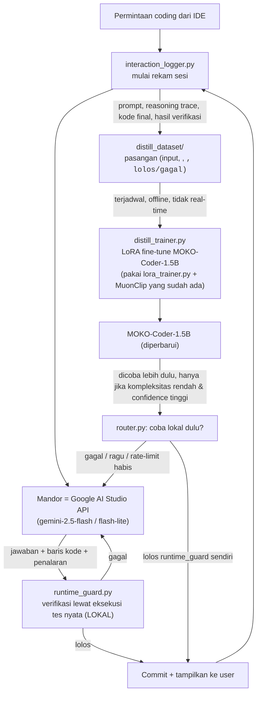

# Revisi Arsitektur: Mandor adalah API Gratis, MOKO 1.5B adalah Murid yang Belajar
## Meluruskan Peran — Bukan "Lokal Mengatur API", tapi "API Mengerjakan, Lokal Mendistilasi Cara Berpikirnya"

> **Dokumen revisi** — mengoreksi `22_HYBRID_ORCHESTRATION_MANDOR_PEKERJA.md`. Simpan
> sebagai **`docs/riset/23_REVISI_MANDOR_API_MURID_LOKAL.md`** agar urutan riset tetap
> berlanjut dan histori koreksi tetap terlihat (jangan menimpa dokumen 22 — biarkan
> keduanya berdampingan sebagai jejak evolusi desain).

---

## 0. Apa yang Salah di Dokumen 22, dan Kenapa

Dokumen 22 menempatkan peran seperti ini:

| | Dokumen 22 (keliru) |
|---|---|
| **Mandor** (pengambil keputusan, orkestrator) | Model lokal MOKO (1.5B / 4B) |
| **Pekerja** (eksekusi kode berat) | API eksternal (DeepSeek, Kimi, GLM, dst.) |

Ini terbalik dari maksud Anda. Yang benar:

| | Revisi (benar) |
|---|---|
| **Mandor** (yang benar-benar mengerjakan/menulis kode, karena dialah yang punya kapasitas) | **API gratis** — dalam kasus Anda, Google AI Studio (Gemini) |
| **Murid/Pekerja lokal** (belum sanggup mengerjakan sendiri, sedang belajar) | **MOKO-Coder 1.5B** |
| **Tujuan lokal belajar** | Bukan mengatur mandor, melainkan **mengamati baris kode dan penalaran yang dihasilkan mandor**, lalu didistilasi ke bobotnya sendiri lewat *fine-tuning* — supaya **jangka panjang tidak bergantung pada API**. |

Jadi ini bukan arsitektur "orkestrasi hybrid" gaya Fugu/TRINITY (koordinator kecil yang
mengatur banyak model besar) — itu tetap relevan sebagai *referensi konsep*, tapi bukan
skema yang sedang Anda bangun. Yang Anda bangun lebih dekat ke **distilasi pengetahuan
berkelanjutan** (*continuous knowledge distillation*) ala DeepSeek-R1 → varian *distilled*
8B/1.5B: **satu guru besar mengajar satu murid kecil lewat contoh nyata**, bukan satu
murid kecil yang mengarahkan banyak guru besar.

Bagian 1 dokumen 22 (kenapa 1.5B tidak cukup untuk *coding* kelas profesional) **tetap
berlaku dan menjadi alasan utama** kenapa skema guru–murid ini dibutuhkan: MOKO 1.5B
belum punya kapasitas untuk bernalar sendiri di banyak kasus, jadi untuk saat ini
pekerjaan pengkodean nyata **diserahkan penuh ke API**, sambil setiap interaksi
direkam sebagai bahan belajar.

---

## 1. Prinsip Inti Revisi Ini

1. **Semua tugas pengkodean nyata (untuk sekarang) dikerjakan oleh API**, bukan oleh
   MOKO 1.5B. Model lokal tidak "memutuskan" atau "mengatur" API — API-lah yang
   mengerjakan tugas dari awal sampai akhir (baca permintaan → bernalar → menulis kode
   → menjelaskan alasannya).
2. **MOKO 1.5B berperan sebagai pengamat/murid**, bukan sebagai *worker* aktif dalam
   jalur produksi kode. Tugasnya: menyerap **pola baris kode** dan **pola penalaran**
   (bukan cuma jawaban akhir) dari setiap interaksi dengan API, agar kemampuan itu
   perlahan berpindah ke bobotnya sendiri.
3. **Tujuan jangka panjang adalah kemandirian**, bukan orkestrasi permanen. Setiap
   fine-tune adalah langkah menuju hari di mana MOKO 1.5B bisa mengerjakan sendiri
   kasus-kasus yang sekarang masih wajib dilempar ke API. Ini pendekatan bertahap,
   diukur, bukan lompatan sekali jadi.
4. **API-nya bebas/dinamis** — tidak dikunci ke satu penyedia berbayar tertentu.
   Untuk Anda saat ini: **Google AI Studio (Gemini)**, karena gratis dan tanpa kartu
   kredit. Tapi sistem tetap harus ditulis generik (lewat adapter), supaya penyedia
   lain bisa ditukar tanpa membongkar ulang arsitektur — termasuk kalau suatu saat
   Anda ingin mencampur beberapa API gratis sekaligus untuk menyiasati kuota.

---

## 2. Kenapa Google AI Studio Cocok — dan Batasannya yang Harus Dirancang Sejak Awal

Google AI Studio dipilih karena **penggunaan API-nya gratis di semua region**, tanpa
kartu kredit, dan mendukung *context window* besar (1 juta token) bahkan di tingkat
gratis. Tapi ini gratis dengan syarat yang harus ditangani sistemnya, bukan diabaikan:

- **Kuota bertingkat per model**: model kelas *Flash*/*Flash-Lite* mendapat kuota
  permintaan-per-hari dan permintaan-per-menit yang jauh lebih longgar dibanding model
  kelas *Pro*, yang di tingkat gratis dibatasi sangat ketat (puluhan permintaan per
  hari saja). Per pertengahan 2026, akses gratis ke model kelas Pro bahkan sempat
  dipersempit lebih jauh menjadi terbatas ke *Flash*/*Flash-Lite* saja pada sebagian
  akun — jadi jangan mendesain sistem yang **menganggap** kuota Pro tersedia.
- **Batas berlapis**: permintaan-per-menit (RPM), token-per-menit (TPM), dan
  permintaan-per-hari (RPD) semuanya berlaku sekaligus — sistem bisa kena batas RPM
  duluan walau TPM masih longgar, atau sebaliknya kalau prompt-nya besar.
- **Kuota per-project, bukan per-API-key** — membuat banyak *API key* tidak menambah
  kuota; ini penting supaya `worker_pool.py`/`provider_adapter.py` tidak salah asumsi.
- **Data di tingkat gratis bisa dipakai Google untuk melatih model mereka** — relevan
  kalau MOKO nanti menangani kode yang sensitif/privat; perlu jalur "mode privasi"
  yang tetap memakai jalur lokal murni untuk kasus semacam itu.
- **Angka-angka di atas berubah cukup sering** (Google beberapa kali memangkas kuota
  gratis sepanjang 2026) — jadi jangan menghardcode angka RPM/RPD di kode; baca dari
  dasbor `aistudio.google.com` atau tangani lewat *header* respons `429` dan
  *retry* dengan *backoff*, bukan dengan angka tetap yang bisa basi.

Implikasi desain: sistem **wajib** punya *rate limiter* dan antrean lokal di sisi
klien (bukan cuma mengandalkan server menolak), plus *exponential backoff* saat kena
`429 RESOURCE_EXHAUSTED`, dan idealnya **cache** hasil untuk permintaan yang identik
supaya tidak memboroskan kuota harian yang terbatas.

---

## 3. Diagram Alur yang Direvisi



Perbedaan kunci dari diagram di dokumen 22: **tidak ada lagi panah "mandor lokal
memutuskan pekerja API mana yang dipanggil dan bagaimana"**. Panah keputusan cuma satu
arah sederhana: coba lokal dulu **hanya** untuk kasus yang murah dan sudah pernah
"diajarkan" API sebelumnya (diukur lewat tingkat lolos `runtime_guard.py`); selain itu,
API langsung yang mengerjakan.

---

## 4. Komponen yang Perlu Dibangun

### 4.1 `moko_agents/dual_system/gemini_adapter.py`
Adapter tipis khusus Google AI Studio (bukan adapter generik OpenAI-compatible seperti
di dokumen 22, karena Gemini punya format *request*/*response* sendiri lewat SDK
`google-genai` atau REST-nya). Tanggung jawab:
- Kirim prompt + kode konteks ke `gemini-2.5-flash` (atau `flash-lite` untuk hemat
  kuota pada tugas ringan).
- **Minta model menyertakan penalarannya secara eksplisit**, bukan cuma kode akhir —
  ini krusial karena yang mau didistilasi bukan cuma jawaban, tapi *cara sampai ke
  jawaban itu* (mirip pasangan `<thought>/<action>` yang sudah dirancang
  `build_moko_coder_dataset.py` di MOKO).
- Menangani `429`, *retry* dengan *backoff* eksponensial, dan mencatat sisa kuota bila
  tersedia dari header respons.

### 4.2 `moko_agents/dual_system/interaction_logger.py`
Merekam **setiap** sesi interaksi dengan mandor API sebagai calon data latih:
```python
@dataclass
class DistillSample:
    prompt: str                 # permintaan asli user / konteks tugas
    reasoning_trace: str        # penalaran mandor (bukan cuma jawaban akhir)
    code_output: str            # kode final yang dihasilkan mandor
    passed_guard: bool          # hasil verifikasi runtime_guard.py (lolos tes nyata?)
    task_complexity: float      # estimasi router.py, dipakai untuk kurasi kurikulum
    timestamp: str
```
Hanya sampel yang **lolos** `runtime_guard.py` yang layak masuk *dataset* distilasi —
ini menjaga agar MOKO tidak belajar dari kode yang salah/berhalusinasi, konsisten
dengan prinsip *Verifiable Rewards* yang sudah dipakai MOKO.

### 4.3 `moko_agents/dual_system/distill_trainer.py`
Proses **offline, terjadwal** (bukan *real-time*, bukan bagian dari jalur jawab-cepat
ke user) yang:
- Mengambil sampel baru dari `distill_dataset/` sejak sesi latih terakhir.
- Menjalankan *fine-tune* LoRA memakai `lora_trainer.py` + MuonClip yang **sudah ada**
  di MOKO — tidak perlu *tooling* pelatihan baru, ini pipeline yang sudah dimiliki.
- Menyimpan versi model baru dengan penomoran (`moko-coder-1.5b-v{n}`), plus metrik
  evaluasi sebelum dipasang menggantikan versi aktif.

### 4.4 Perluasan `router.py` — "coba lokal dulu" hanya dengan syarat ketat
```python
def should_try_local_first(task_complexity: float, moko_confidence: float) -> bool:
    """
    Hanya coba MOKO lokal dulu jika:
    - tugas serupa sudah berulang kali dipelajari dari mandor (confidence tinggi), DAN
    - kompleksitas tugas rendah.
    Selain itu, langsung ke mandor API. Ini KEBALIKAN dari default dokumen 22
    (yang menjadikan lokal sebagai jalur utama dan API sebagai cadangan).
    """
    return task_complexity < LOCAL_THRESHOLD and moko_confidence > CONFIDENCE_THRESHOLD
```
`moko_confidence` dihitung dari riwayat: persentase tugas sejenis yang, ketika dicoba
lokal, **lolos** `runtime_guard.py` tanpa perlu dikoreksi ulang oleh mandor. Ambang ini
naik secara alami seiring makin banyak siklus distilasi — dengan begitu porsi tugas
yang bisa ditangani lokal **tumbuh organik**, bukan ditentukan asumsi di awal.

### 4.5 `runtime_guard.py` — tetap gerbang wajib, tanpa perubahan peran
Tidak berubah dari dokumen 22: baik keluaran mandor API maupun keluaran MOKO lokal
(saat dicoba) **sama-sama** wajib lolos verifikasi eksekusi tes nyata sebelum di-*commit*.
Ini juga sekaligus filter kualitas data latih di 4.2.

---

## 5. Peta Jalan Implementasi (Revisi)

| Fase | Fokus | Keluaran |
|---|---|---|
| **Fase 1 — Jalur Mandor Murni** | `gemini_adapter.py` + `runtime_guard.py` sebagai satu-satunya jalur produksi kode. Belum ada logika lokal sama sekali dalam pengambilan keputusan. | Tugas coding nyata sepenuhnya dikerjakan API, terverifikasi lokal sebelum commit. |
| **Fase 2 — Perekaman Data** | Tambahkan `interaction_logger.py`. Setiap sesi yang lolos guard otomatis tersimpan sebagai `DistillSample`. | `distill_dataset/` mulai terisi tanpa mengganggu jalur produksi. |
| **Fase 3 — Distilasi Pertama** | Jalankan `distill_trainer.py` secara manual/terjadwal begitu dataset cukup besar (mis. ratusan sampel lolos-guard per kategori tugas). Evaluasi versi baru MOKO-Coder secara terpisah, **belum** dipakai di jalur produksi. | `moko-coder-1.5b-v2` teruji offline. |
| **Fase 4 — Uji Coba Lokal Terbatas** | Aktifkan `should_try_local_first()` hanya untuk kategori tugas dengan bukti kuat (confidence tinggi dari evaluasi Fase 3). Semua tetap lewat `runtime_guard.py`. | Sebagian kecil tugas mulai ditangani lokal, terukur, tidak spekulatif. |
| **Fase 5 — Distilasi Berkelanjutan** | Jadwalkan siklus Fase 2→4 berulang. Ambang `CONFIDENCE_THRESHOLD` diturunkan bertahap seiring model membaik, memperluas cakupan tugas yang bisa lokal. | Ketergantungan pada API menurun bertahap dan terukur — bukan janji, tapi tren yang bisa dilihat dari log. |

Perbedaan penting dari peta jalan dokumen 22: **tidak ada fase "mandor terlatih untuk
mengorkestrasi banyak pekerja"** (itu skema Fugu/TRINITY yang tidak relevan di sini).
Semua fase di sini murni tentang **satu arah aliran pengetahuan**: API → data → LoRA →
model lokal yang perlahan makin mandiri.

---

## 6. Risiko & Mitigasi (Revisi)

| Risiko | Dampak | Mitigasi |
|---|---|---|
| Kuota gratis Google AI Studio habis/berubah tiba-tiba | Jalur produksi kode berhenti | Antrean lokal + *backoff*; opsional tambahkan API gratis kedua (mis. penyedia lain) sebagai cadangan lewat adapter terpisah, bukan hardcode satu penyedia |
| Data latih tercemar kode salah | MOKO belajar pola buruk | Hanya sampel yang lolos `runtime_guard.py` masuk dataset — non-negotiable |
| Distilasi dijalankan terlalu dini (data sedikit) | Model lokal *overfit* ke sedikit contoh, percaya diri palsu | `CONFIDENCE_THRESHOLD` awal dibuat sangat tinggi; naikkan cakupan lokal hanya berdasar bukti evaluasi, bukan jadwal waktu |
| Privasi kode terkirim ke API pihak ketiga (tingkat gratis bisa dipakai untuk melatih model Google) | Risiko kebocoran data sensitif | Mode "lokal-saja" untuk kode privat, sadar bahwa ini berarti kualitas lebih rendah untuk kasus tersebut sampai MOKO cukup mandiri |
| Rekaman interaksi menumpuk tak terkelola | Disk penuh, sulit dikurasi | `interaction_logger.py` menandai kategori tugas & kompleksitas sejak awal, memudahkan kurasi/pruning saat dataset membesar |

---

## 7. Kesimpulan

1. Peran yang benar: **API gratis (Google AI Studio) adalah mandor** yang benar-benar
   mengerjakan kode; **MOKO 1.5B adalah murid** yang belajar dari hasil dan penalaran
   mandor, bukan pengatur mandor.
2. Ini bukan arsitektur orkestrasi multi-agent (Fugu/TRINITY dari dokumen 22) —
   itu tetap referensi konsep yang sah untuk masa depan bila suatu saat Anda punya
   banyak API sekaligus untuk diorkestrasi, tapi bukan skema yang berlaku sekarang.
3. Skema yang tepat untuk sekarang adalah **distilasi pengetahuan berkelanjutan**:
   rekam setiap interaksi ber-verifikasi → *fine-tune* LoRA berkala → uji coba lokal
   bertahap dengan ambang kepercayaan yang naik seiring bukti, bukan asumsi.
4. `runtime_guard.py` tetap gerbang wajib untuk **kedua** sumber kode (API maupun
   lokal) — ini sekaligus penjaga kualitas produksi dan penjaga kualitas data latih.
5. Tujuan akhirnya eksplisit: **mengurangi ketergantungan pada API dari waktu ke
   waktu**, diukur lewat pertumbuhan `moko_confidence` per kategori tugas, bukan
   klaim kemandirian yang belum terbukti.

---

## Referensi

- Google AI for Developers. *Gemini API Rate Limits*, ai.google.dev/gemini-api/docs/rate-limits (diakses Juli 2026).
- Google AI for Developers. *Gemini Developer API Pricing*, ai.google.dev/gemini-api/docs/pricing (diakses Juli 2026).
- DeepSeek-AI. *DeepSeek-R1: Incentivizing Reasoning Capability in LLMs via Reinforcement Learning*, 2025 — rujukan pola distilasi guru-besar → murid-kecil yang mendasari skema di dokumen ini.
- Dokumen internal MOKO: `finetune/lora_trainer.py`, `finetune/build_moko_coder_dataset.py`, `dual_system/runtime_guard.py` (rujukan komponen yang sudah ada dan dipakai ulang).
- `22_HYBRID_ORCHESTRATION_MANDOR_PEKERJA.md` — didokumentasikan sebagai catatan sejarah desain, dikoreksi oleh dokumen ini.

> Catatan: angka kuota/harga Google AI Studio pada Bagian 2 berubah cukup sering
> sepanjang 2026 (beberapa kali dipangkas). Selalu cek dasbor `aistudio.google.com`
> untuk angka aktual proyek Anda saat mengimplementasikan *rate limiter*, jangan
> menghardcode angka dari dokumen ini.
